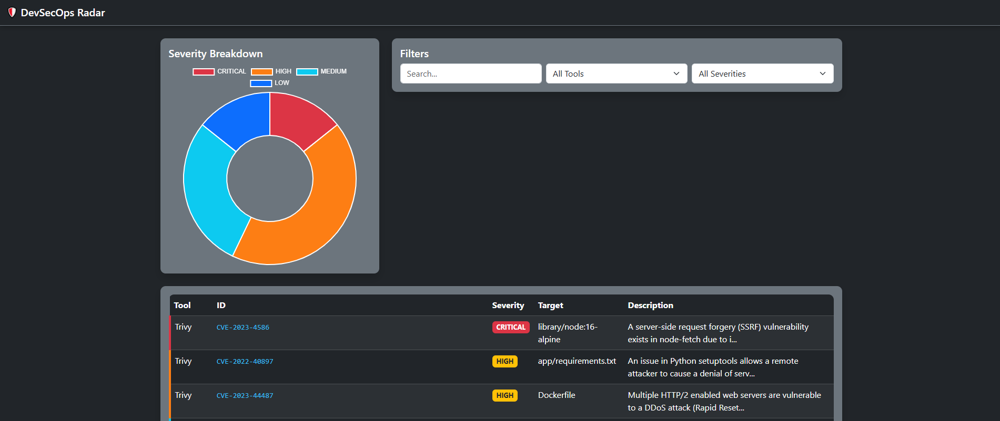

# 🛡️ DevSecOps Radar

**Unified Security Observability for CI/CD Pipelines**

Stop drowning in alerts from Trivy, Semgrep, and other tools. DevSecOps Radar aggregates, correlates, and visualizes findings in a single, beautiful, **offline-capable** dashboard.

[](https://github.com/Mehrdoost/devsecops-radar/stargazers)
[](https://github.com/Mehrdoost/devsecops-radar/blob/main/LICENSE)
[](https://github.com/Mehrdoost/devsecops-radar/issues)
[](https://github.com/Mehrdoost/devsecops-radar/releases)

---

## 🚀 Quick Start

```bash
git clone https://github.com/Mehrdoost/devsecops-radar.git
cd devsecops-radar
docker-compose up
```

Visit http://localhost:8080 – the dashboard loads instantly with sample data.

**🐍 No Docker?**
```bash
pip install -e .
devsecops-radar-web
```

---

## 📸 Screenshot




---

## 🎯 Key Features

*   ✅ Aggregates findings from multiple scanners (Trivy, Semgrep, and soon more)
*   🔍 Filters & searches across all vulnerabilities in real time
*   🧠 Correlates related issues (e.g., vulnerable package + exposed secret)
*   ⚡ Offline‑first – all front‑end assets are bundled (no CDN dependency)
*   🤖 GitHub Action ready – one‑step integration into your CI/CD
*   📊 Clean dark dashboard with severity doughnut chart & detailed table

---

## 🔧 Usage

### 1️⃣ Generate scanner outputs

```bash
trivy image --format json --output trivy.json nginx:latest
semgrep --config=auto --json --output semgrep.json .
```

### 2️⃣ Merge findings

```bash
devsecops-radar --trivy trivy.json --semgrep semgrep.json
```

**Or let the CLI scan directly:**

```bash
devsecops-radar --trivy nginx:latest --semgrep .
```

### 3️⃣ Launch the dashboard

```bash
devsecops-radar-web
```

### 🐳 Docker alternative

```bash
docker run -v $(pwd)/findings.json:/app/findings.json -p 8080:8080 Mehrdoost/devsecops-radar
```

---

## 🤖 GitHub Action

Add DevSecOps Radar to your pipeline with a single step:

```yaml
- name: DevSecOps Radar
  uses: Mehrdoost/devsecops-radar/action@main
  with:
    trivy_report: trivy-results.json
    semgrep_report: semgrep-results.json
```

The action merges findings and posts a summary (optionally comments on the PR).

---

## 🗺️ Roadmap

- [x] Trivy & Semgrep integration
- [x] Offline dashboard (local Bootstrap/Chart.js)
- [x] Sample data for instant preview
- [ ] Snyk & OWASP ZAP support
- [ ] Scan history with trend charts
- [ ] PDF report generation
- [ ] Native GitHub Security Advisory integration

---

## 🤝 Contributing

Pull requests and issues are welcome!
If you have a tool you want integrated, open an issue with a sample JSON output.

---

## 📜 License

This project is licensed under the MIT License – see the [LICENSE](LICENSE) file for details.

⭐ **If this project helped your team, consider dropping a star!**
