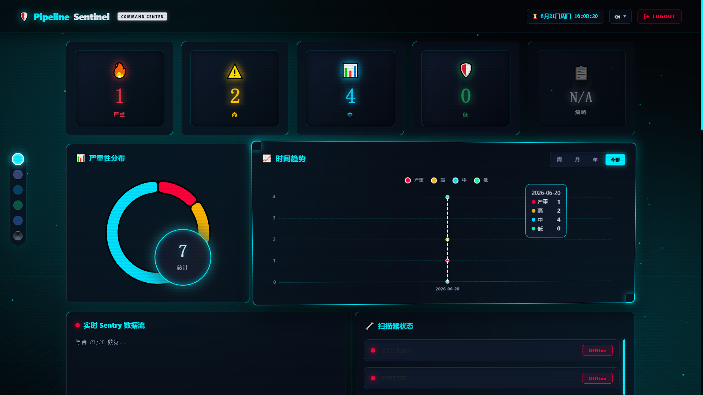

<div align="center">

# 🛡️ Pipeline Sentinel

### *The Open‑Source DevSecOps Command Center — Unify, Analyse, Remediate.*

[](https://pypi.org/project/devsecops-radar/)
[](LICENSE)
[](https://github.com/Mehrdoost/devsecops-radar/releases)
[](https://github.com/Mehrdoost/devsecops-radar/actions)
[](https://codecov.io/gh/Mehrdoost/devsecops-radar)
[](https://github.com/Mehrdoost/devsecops-radar/stargazers)

<br>

> 📖 **Read this in:** [Русский](README_ru.md) | [中文](README_zh.md) | [العربية](README_ar.md)

<br>

*Severity doughnut, trend line chart, attack‑path graph (clickable nodes), topology view, executive summary, and attack simulation panel — all fully offline.*


</div>

---

<details>
<summary><b>📑 Table of Contents (Click to expand)</b></summary>

1. [What Is Pipeline Sentinel? (Simple Explanation)](#-what-is-pipeline-sentinel-simple-explanation)
2. [Why You Need It](#-why-you-need-it)
3. [Where to Run It in Your Network](#-where-to-run-it-in-your-network)
4. [Network Flow & Topology](#-network-flow--topology)
5. [Dashboard Preview](#-dashboard-preview)
6. [Quick Start](#-quick-start)
7. [Prerequisites](#-prerequisites)
8. [Installation](#-installation)
9. [How to Use (Step‑by‑Step)](#-how-to-use-stepbystep)
10. [Complete Command Reference](#-complete-command-reference)
11. [Core Capabilities](#-core-capabilities)
12. [Community Rules & Online Updates](#-community-rules--online-updates)
13. [Attack Simulation & What‑If Analysis](#-attack-simulation--what‑if-analysis)
14. [Security Improvements in v0.4.6](#-security-improvements-in-v046)
15. [Architecture](#-architecture)
16. [Roadmap](#-roadmap)
17. [Testing & CI](#-testing--ci)
18. [Security Policy](#-security-policy)
19. [Contributing](#-contributing)
20. [Code of Conduct](#-code-of-conduct)
21. [Support Development](#-support-development)
22. [Author](#-author)
23. [License](#-license)

</details>

---

## 👨‍👩‍👧 What Is Pipeline Sentinel? (Simple Explanation)

> **Imagine you have several security guards**, each watching a different door of a building. They all shout their findings in different languages, and you have to run around to understand what’s going on.

**Pipeline Sentinel** puts them all in one room, translates their reports, and shows you a single, clear screen with the full picture. It connects to tools like **Trivy** (checks your containers), **Semgrep** (scans your code), **Poutine** (audits your GitLab pipelines), **Zizmor** (secures your GitHub Actions), and **Gitleaks** (finds secrets). 

Instead of digging through multiple JSON files, you get a **beautiful, dark‑mode command‑center dashboard** that tells you what’s critical, how risks are trending, and even how an attacker might chain several small issues into a big problem.

*Think of it as a **security camera system for your entire CI/CD pipeline** — it watches everything, alerts you, suggests fixes, and even lets you simulate attack chains, all without needing internet access if you want.*

---

## 💥 Why You Need It

In 2026, **supply chain attacks** have become the #1 threat. Tools like Trivy themselves were compromised, and attackers now inject malicious code directly into build pipelines. **You can no longer just scan your code; you must scan your pipeline.**

**Pipeline Sentinel gives you:**
* 🎯 **Unified Aggregation:** One screen for all scanners – stop juggling log files.
* 🧠 **Graph AI Insights:** AI that understands attack chains – *"A leaked secret + an old library = a disaster."*
* ⚡ **Auto-Remediation:** Automatically patches files and opens a pull request (with automated backups) with a single flag.
* 👥 **Human Review Mode:** Step-by-step interactive interface to inspect each fix before applying it to production.
* 📊 **Compliance-Ready Reports:** Instantly generate beautiful, executive-ready PDF summaries for auditors or stakeholders.
* ⚔️ **Attack Simulation:** Select security findings and automatically generate operational proof-of-concept scripts.
* 🔒 **Air-Gapped Privacy:** 100% offline capable. Perfect for highly restricted environments where data residency is paramount.
* 🧙 **Interactive Wizard:** A single command leads you through the entire initialization and onboarding process.
* 🛒 **Rules Marketplace:** Dynamically fetch and update curated detection definitions directly from the community.

---

## 📍 Where to Run It in Your Network

Pipeline Sentinel is designed to adapt to your setup. You decide where it fits best:

| Deployment Mode | Operational Profile & Context |
| :--- | :--- |
| 🖥️ **Local Dev Machine** | Run the CLI and dashboard right on your laptop. Perfect for individual pentesters or developers who want instant, localized feedback. |
| 🔧 **CI/CD Runner Pipeline** | Integrate directly into Jenkins/GitLab CI or GitHub Actions. Fail builds automatically if critical vulnerabilities exceed your security policy rules. |
| 🏢 **Central Security Operations** | Deploy via Docker on a central server to collect scan history across multiple teams, unifying visibility into a shared security console. |
| 🌐 **Air‑Gapped Environments** | Air-gap friendly. Deploy the standalone Docker bundle to isolated networks with zero external asset dependencies or tracker requests. |

---

## 🔍 Network Flow & Topology

### 🔄 Logical Data Lifecycle
The functional flow below maps exactly how raw multi-scanner inputs route through our parsing engine to be normalized and centralized:

```mermaid
%%{init: {'theme': 'base', 'themeVariables': { 'primaryColor': '#1e1e2e', 'primaryTextColor': '#cdd6f4', 'primaryBorderColor': '#6c7086', 'lineColor': '#89b4fa', 'clusterBkg': '#181825', 'clusterBorder': '#585b70', 'fontFamily': 'system-ui, sans-serif', 'fontSize': '14px'}}}%%
flowchart LR
    %% 🎨 Class Definitions for a Beautiful UI
    classDef scanner fill:#24273a,stroke:#a6e3a1,stroke-width:2px,color:#a6e3a1
    classDef cliEngine fill:#24273a,stroke:#89b4fa,stroke-width:2px,color:#89b4fa
    classDef coreModule fill:#24273a,stroke:#f9e2af,stroke-width:2px,color:#f9e2af
    classDef web fill:#24273a,stroke:#94e2d5,stroke-width:2px,color:#94e2d5
    classDef dash fill:#24273a,stroke:#cba6f7,stroke-width:2px,color:#cba6f7
    classDef database fill:#1e1e2e,stroke:#f38ba8,stroke-width:2px,color:#f38ba8
    classDef external fill:#1e1e2e,stroke:#b4befe,stroke-width:2px,stroke-dasharray: 5 5,color:#b4befe

    subgraph ScannerInputs ["External Scanners"]
        T([Trivy]):::scanner
        S([Semgrep]):::scanner
        P([Poutine]):::scanner
        Z([Zizmor]):::scanner
        G([Gitleaks]):::scanner
    end

    subgraph CLI ["🛡️ CLI Engine (devsecops-radar)"]
        Plugins[[Plugin Discovery]]:::cliEngine
        Adapt[[Scanner Adapter]]:::cliEngine
        Norm[[Normalize & Validate]]:::cliEngine
        Risk{{compute_dynamic_risk_score}}:::cliEngine
    end

    subgraph Core ["Core Modules"]
        Analyzer{{🧠 AI Analyzer - Ollama/LiteLLM}}:::coreModule
        DB[(Database - SQLAlchemy)]:::database
        Remed([Auto-Fix & PR]):::coreModule
        RuleEng{{Rule Fusion Engine}}:::coreModule
        Report>Report Gen]:::coreModule
        SARIF>SARIF Export]:::coreModule
        CycloneDX>CycloneDX Export]:::coreModule
        Notifier([Jira/Asana Notifier]):::coreModule
        SBOM>SBOM Generator]:::coreModule
        AttackSim{{Attack Simulation}}:::coreModule
        RAG[/RAG Search/]:::coreModule
    end

    subgraph WebApp ["🌐 Web Application"]
        Flask(Flask App):::web
        Blueprints([Dashboard / Sentry / Attack-Paths / Topology / Summary]):::web
        Waitress(Waitress WSGI Server):::web
    end

    subgraph DashboardUI ["🖥️ Dashboard UI"]
        LiveFeed([Live Sentry Feed]):::dash
        Charts[/Severity & Trend Charts/]:::dash
        AttackGraph[/Attack Path Graph/]:::dash
        TopoGraph[/Topology Graph/]:::dash
        FindingsTable[/Findings Table/]:::dash
        RemedPlan[/AI Remediation Plan/]:::dash
        Policy[/Policy Status/]:::dash
        Export[/Report Modal/]:::dash
    end

    %% External & Outputs Data Definitions
    Out[(findings.json)]:::database
    PR[/PR / Patch File/]:::external
    Ext([External Services]):::external
    LocalAI{{Local AI Model}}:::external
    CommunityRepo[(Community Rules Repo)]:::external
    Sandbox{{Isolated Container}}:::external
    Syft([Syft CLI]):::external
    SentryBuffer[(In-Memory Buffer)]:::database
    TopoFile[(topology.json)]:::database

    %% Scanner data flow
    ScannerInputs -->|"Raw Reports"| Adapt
    Adapt --> Norm
    Norm --> Risk

    %% CLI output
    Risk -->|"findings.json"| Out
    Risk --> DB
    Risk --> Analyzer

    %% Core interactions
    Analyzer --> DB
    Analyzer --> Remed
    Remed -->|"git push/patch"| PR
    RuleEng -->|"Policy Check"| CLI
    RuleEng -->|"OPA Rego (beta)"| CLI

    %% Web app
    Out --> Flask
    DB --> Flask
    Flask --> Blueprints
    Blueprints --> Waitress
    Waitress --> DashboardUI

    %% External integrations
    Notifier -->|"Jira/Asana"| Ext
    Analyzer -->|"Ollama"| LocalAI
    RuleEng -->|"git clone"| CommunityRepo
    AttackSim -->|"Docker Sandbox"| Sandbox
    SBOM -->|"syft"| Syft
    
    %% UI details
    LiveFeed -.- SentryBuffer
    Charts --> DB
    AttackGraph --> Analyzer
    TopoGraph --> TopoFile
    RemedPlan --> Analyzer
    Policy --> RuleEng
    
    %% Split multiple targets for maximum compatibility
    Export --> Report 
    Export --> SARIF 
    Export --> CycloneDX

    %% Beautiful Subgraph Styling
    style ScannerInputs fill:#1e1e2e,stroke:#a6e3a1,stroke-width:2px,stroke-dasharray: 5 5,rx:10,ry:10
    style CLI fill:#1e1e2e,stroke:#3b82f6,stroke-width:2px,rx:10,ry:10
    style Core fill:#1e1e2e,stroke:#f59e0b,stroke-width:2px,rx:10,ry:10
    style WebApp fill:#1e1e2e,stroke:#10b981,stroke-width:2px,rx:10,ry:10
    style DashboardUI fill:#11111b,stroke:#a6e3a1,stroke-width:2px,rx:10,ry:10
```



### 🌐 Operational Infrastructure Mapping
Once processed, the centralized findings are rendered inside your topology mapping network boundaries, visualising the operational relationship between distinct pipeline segments:


---

## 📸 Dashboard Preview



*(See the animated demo at the top of this README for a live preview of the UI in action!)*


---

## 🚀 Quick Start

Get up and running in 3 simple steps:

```bash
# 1. Install from PyPI
pip install devsecops-radar

# 2. Feed scanner data (sample data is included in the repo)
devsecops-radar --trivy sample_trivy.json --semgrep sample_semgrep.json

# 3. Launch the dashboard
devsecops-radar-web
```

Open **http://localhost:8080** — your unified command center is live with sample findings.

> [!TIP]
> 🧙 **Want a fully guided setup?** Run the interactive wizard:
> ```bash
> devsecops-radar --wizard
> ```

---

## 📦 Installation

<details>
<summary><b>View All Installation Options (PyPI, Docker, Source, One-Command)</b></summary>
<br>

### Option 1 — PyPI (Recommended)
```bash
pip install devsecops-radar
```

### Option 2 — From Source
```bash
git clone https://github.com/Mehrdoost/devsecops-radar.git
cd devsecops-radar
pip install -e ".[dev]"
```

### Option 3 — Docker
```bash
docker pull ghcr.io/mehrdoost/devsecops-radar:latest
docker run -p 8080:8080 ghcr.io/mehrdoost/devsecops-radar:latest
```
**Mount your own findings file:**
```bash
docker run -p 8080:8080 -v $(pwd)/findings.json:/data/findings.json ghcr.io/mehrdoost/devsecops-radar:latest
```
**Or use Docker Compose:**
```bash
docker compose up
```

### 🧙 One‑Command Install (curl)
```bash
curl -fsSL https://raw.githubusercontent.com/Mehrdoost/devsecops-radar/main/install.sh | bash
```
*This script installs Python dependencies, Ollama, pulls the AI model, and starts the wizard.*

</details>

---

## 📋 Prerequisites

> [!IMPORTANT]
> Pipeline Sentinel relies on external security tools to produce the JSON reports it consumes. You must install these tools separately according to your needs.

- **Required for offline scanning:** Trivy, Semgrep, Poutine, Zizmor, Gitleaks.
- **Optional:** Ollama (AI analysis), Docker (Sandboxing), OPA (Rego policy).

> 📖 **See `PREREQUISITES.md` for full installation details of these tools.**

---

## 🧭 How to Use (Step‑by‑Step)

<details open>
<summary><b>1. Run Your Security Scanners</b></summary>
<br>

Generate JSON output from your tools:
```bash
trivy image --format json -o trivy.json nginx:latest
semgrep --config=auto --json --output semgrep.json .
poutine scan ./repo --format json --output poutine.json
zizmor scan ./repo --output zizmor.json --format json
gitleaks detect --source . --report-format json --report-path gitleaks.json
```
</details>

<details open>
<summary><b>2. Merge Findings with the CLI</b></summary>
<br>

```bash
devsecops-radar --trivy trivy.json --semgrep semgrep.json --poutine poutine.json --zizmor zizmor.json --gitleaks gitleaks.json
```
*This produces a single `findings.json` with all findings merged and normalised.*
</details>

<details open>
<summary><b>3. View the Dashboard Engine</b></summary>
<br>

Execute the web wrapper to spin up your centralized analytics engine:
```bash
devsecops-radar-web
```

### 📊 Tactical Web Console Architecture
The single-page real-time dashboard elegantly partitions telemetry into high-impact actionable items:

| Dashboard Component | Interface Visualization Type | Core Operational Value |
| :--- | :--- | :--- |
| **Severity Breakdown** | Dynamic Doughnut Charts | Instant tracking of global exposure density and total counts. |
| **Trend Over Time** | Aggregated Line Timelines | Historical trajectory graphs drawn from persistent scan logs. |
| **Pipeline Security** | Specialized Poutine + Zizmor Matrix | Micro-telemetry analyzing supply chain health and meta-workflows. |
| **Attack Path Graph** | Interactive D3.js Force Nodes | Clickable chain mapping demonstrating structural flaw correlations. |
| **Executive Summary** | Context-Rich Summary & Risk Scoring | Algorithmic threat intelligence translated into executive-ready metrics. |
| **Findings Datagrid** | Searchable Paginated Checkbox Tables | Granular configuration control built for isolating entities for target simulations. |

</details>

<details>
<summary><b>4. Enable AI Analysis (Optional)</b></summary>
<br>

```bash
ollama pull llama3.2:latest
devsecops-radar --trivy trivy.json --analyze
devsecops-radar-web
```
The LLM generates `findings_ai_summary.json` containing: `executive_summary`, `risk_score`, `attack_paths` (with MITRE ATT&CK), `top_remediations`, and `false_positives_likely`.


</details>

<details>
<summary><b>5. Auto‑Remediation (with Human Review)</b></summary>
<br>

```bash
# Apply fixes automatically
devsecops-radar --trivy trivy.json --analyze --fix

# Interactive step‑by‑step review
devsecops-radar --trivy trivy.json --analyze --fix --review
```


> [!NOTE]
> All modified files are backed up to `~/.devsecops-radar/backups/`. The tool creates a new git branch `auto-fix` and pushes it for review.
</details>

<details>
<summary><b>6. Policy Enforcement</b></summary>
<br>

Create a `policy.json` file:
```json
{
  "max_critical": 5, 
  "on_violation": "fail"
}
```
```bash
devsecops-radar --trivy trivy.json --policy policy.json
```
*If critical findings exceed 5, the command exits with code 1. You can also use OPA Rego policies (`--rego-policy`).*
</details>

<details>
<summary><b>7. Generate Compliance & Standard Reports</b></summary>
<br>

```bash
# PDF report with compliance mapping
devsecops-radar --trivy trivy.json --analyze --compliance CIS --report cis-report.pdf

# Export as SARIF for GitHub Code Scanning
devsecops-radar --trivy trivy.json --export-sarif report.sarif

# Export as CycloneDX SBOM
devsecops-radar --trivy trivy.json --export-cyclonedx report.cdx.json
```
</details>

<details>
<summary><b>8. Security Badge for Your Project</b></summary>
<br>

Embed a dynamic security badge in your README:
```markdown
[](https://github.com/Mehrdoost/devsecops-radar)
```
</details>

<details>
<summary><b>9. Jira / Asana Integration (New!)</b></summary>
<br>

Set environment variables to create issues automatically:
```bash
export JIRA_URL="https://your-domain.atlassian.net"
export JIRA_TOKEN="your-api-token"
devsecops-radar --trivy trivy.json --analyze --notify-jira

export ASANA_TOKEN="your-asana-token"
export ASANA_WORKSPACE="your-workspace-gid"
devsecops-radar --trivy trivy.json --analyze --notify-asana
```
</details>

---

## 📋 Complete Command Reference

<details open>
<summary><b>Click to Expand Command Categories</b></summary>
<br>

### 🔎 Scanners & Inputs
| Flag | Description | Example |
| :--- | :--- | :--- |
| `--trivy` | Trivy JSON file or image name | `--trivy` <kbd>results.json</kbd> or <kbd>nginx:latest</kbd> |
| `--semgrep` | Semgrep JSON file or directory | `--semgrep` <kbd>results.json</kbd> or <kbd>./src</kbd> |
| `--poutine` | Poutine JSON file or repo path | `--poutine` <kbd>results.json</kbd> or <kbd>./repo</kbd> |
| `--zizmor` | Zizmor JSON file or repo path | `--zizmor` <kbd>results.json</kbd> or <kbd>./repo</kbd> |
| `--gitleaks`| Gitleaks JSON file or repo path | `--gitleaks` <kbd>results.json</kbd> or <kbd>./repo</kbd> |
| `--rules` | Directory with custom JSON rules | `--rules` <kbd>~/my-rules/</kbd> |
| `--topology`| Path to topology JSON file | `--topology` <kbd>topology.json</kbd> |

### 🧠 AI, Policies & Remediation
| Flag | Description | Example |
| :--- | :--- | :--- |
| `--analyze` | Enable async LLM analysis (Ollama required) | `--analyze` |
| `--llm-backend`| `ollama` (default) or `litellm` | `--llm-backend` <kbd>litellm</kbd> |
| `--llm-model` | Model name | `--llm-model` <kbd>gpt-4o-mini</kbd> |
| `--fix` | Auto‑apply AI‑suggested fixes (with backup) | `--fix` |
| `--review` | Interactive step‑by‑step remediation | `--review` |
| `--policy` | Policy JSON file for gating | `--policy` <kbd>policy.json</kbd> |
| `--rego-policy`| OPA Rego policy file | `--rego-policy` <kbd>policy.rego</kbd> |

### 📊 Reports & Exports
| Flag | Description | Example |
| :--- | :--- | :--- |
| `--output` | Output JSON file (default: findings.json)| `--output` <kbd>merged.json</kbd> |
| `--report` | Generate PDF/JSON/HTML report | `--report` <kbd>report.pdf</kbd> |
| `--export-sarif`| Export findings as SARIF | `--export-sarif` <kbd>report.sarif</kbd> |
| `--export-cyclonedx`| Export findings as CycloneDX | `--export-cyclonedx` <kbd>report.cdx</kbd> |
| `--compliance`| Framework: `CIS`, `PCI-DSS`, `ISO27001` | `--compliance` <kbd>CIS</kbd> |

### ⚙️ Integrations & Setup
| Flag | Description | Example |
| :--- | :--- | :--- |
| `--notify-jira` | Create Jira issues for criticals | `--notify-jira` |
| `--notify-asana`| Create Asana tasks for criticals | `--notify-asana` |
| `--wizard` | Interactive first‑time setup wizard | `--wizard` |
| `--update-rules`| Download/update community rules | `--update-rules` |

<br>

> [!TIP]
> **`devsecops-radar-web` — Web Server Options**

```bash
devsecops-radar-web                         # Launch on http://localhost:8080
FINDINGS_FILE=my.json devsecops-radar-web   # Use a custom findings file
PIPELINE_API_KEY=secret devsecops-radar-web # Enable API authentication
```


</details>

---

## ✨ Core Capabilities

### 🔌 Multi-Scanner Ingestion Engine
* **Pluggable Architecture:** Native modular decoders ingest structured data seamlessly from Trivy, Semgrep, Poutine, Zizmor, and Gitleaks.
* **Hybrid RuleFusion Layer:** Dynamically evaluation of custom local JSON policies mapped on top of live community-driven git feeds.
* **Scan History Optimization:** Persistent historical compilation powered by SQLAlchemy featuring sub-second result slicing.

### 🧠 Advanced Intelligence & Active Remediation
* **Asynchronous Context Enriched LLM:** Multi-backend integration hooks (Ollama/LiteLLM) mapping structural CVE configurations to real-world MITRE ATT&CK vectors.
* **Interactive Remediation Tracks:** Intelligent mutation options applying autonomous hotfixes (`--fix`) balanced by modular human verification checklines (`--review`).
* **Exploit-Aware Scoring:** Modern analytical calculations analyzing vector severities alongside real-time asset exposure and dynamic surface reachability.

### 🛡️ Enterprise Policy & Supply-Chain Governance
* **Policy-as-Code Frameworks:** Advanced control assertions parsing validation rules via strict local JSON constraints or distributed Open Policy Agent (OPA) Rego scripts.
* **Supply Chain Verification:** Comprehensive CycloneDX SBOM data compilation complete with proactive VEX vulnerability masking layers.
* **Air-Gapped Absolute Confidentiality:** Complete dependency localization guaranteeing data processing loops execute with zero external request callbacks.

---

## 🌍 Community Rules & Online Updates

Pipeline Sentinel features a community‑driven rule marketplace housed in a separate repository: `devsecops-radar-rules`.

**How It Works:**
The repository contains curated JSON rule files for all supported scanners. You can pull the latest rules with a single command:
```bash
devsecops-radar --update-rules
```
Rules are stored locally in `~/.devsecops-radar/community-rules/`. To use them alongside your scanner results:
```bash
devsecops-radar --trivy scan.json --rules ~/.devsecops-radar/community-rules/
```

> [!NOTE]
> You can even point to your own private repository via `COMMUNITY_RULES_REPO`!

---

## ⚔️ Attack Simulation & What‑If Analysis

**Interactive attack simulation directly from the dashboard:**
1. Tick the checkboxes next to the findings you want to investigate.
2. Click **“⚡ Simulate Selected”**.
3. A modal displays a generated attack script (`bash`), attack chain description, and (if Docker is available) the sandbox output.

*(You can also click any node in the Attack Path Graph and press **“Simulate this attack”**)*.


---

## ✨ What's New in v0.4.6

- **Live Sentry Feed** – real‑time CI/CD findings appear automatically  
- **Scanner Status** – see which tools are installed and ready  
- **AI Remediation Plan** – step‑by‑step fix instructions right in the dashboard  
- **Policy Status** – live violation indicator from `policy.json`  
- **Topology Graph** – interactive map of your infrastructure assets  
- **Advanced Filters** – filter by tool, severity, target, or description  
- **One‑click Jira & Asana** – send findings directly from the report modal  
- **Auto theme** – follows your OS light/dark preference  
- **All CLI flags now live** – `--export-sarif`, `--export-cyclonedx`, `--compliance`, `--notify-jira`, `--notify-asana`, `--update-rules`, `--rego-policy`  
- **Token‑aware AI chunking** – prevents context overflow for local models  
- **Weighted risk scoring** – merged results reflect actual finding density  
- **Blueprints reorganised** – no more duplicate routes, cleaner architecture  
- **Strict linting & type checks** – zero Ruff/mypy errors

---

## 🏗️ Architecture

```text
devsecops_radar/
├── cli/            # CLI entry point – plugin discovery, policy, remediation
├── core/           # RuleFusion engine, DB (SQLAlchemy), async LLM analysers
├── scanners/       # Pluggable scanner classes (extend ScannerPlugin)
├── plugins/        # ScannerPlugin abstract base class & entry points
└── web/            # Flask dashboard (modular Blueprints, WCAG 2.1 AA)
    ├── dashboard/  # Main dashboard routes & embedded HTML
    ├── attack_paths/
    ├── topology/
    ├── summary/
    └── sentry/     # Live webhook agent for CI/CD
```


---

## 🗺️ Roadmap

| Phase | Feature | Status |
| :--- | :--- | :--- |
| ✅ **Phase 1** | Multi‑scanner engine (Trivy, Semgrep, Poutine, Zizmor), LLM analysis, GH Actions | Done |
| ✅ **Phase 2** | Attack‑path visualization, Policy‑as‑Code, Auto‑remediation, Compliance reports | Done |
| ✅ **Phase 3** | Web dashboard Blueprint, ORM pagination, SBOM, Dynamic Risk Scoring, Gitleaks | Done |
| ✅ **Phase 4** | Advanced attack simulation, VEX filtering, Async LLM, SARIF/CycloneDX | Done |
| 🔲 **Phase 5** | eBPF runtime security agent | Planned |
| 🔲 **Phase 5** | Rule marketplace with YAML | Planned |
| 🔲 **Phase 5** | Pull Request assistant (GitHub App) | Planned |

> [!NOTE]
> See the [open issues](https://github.com/Mehrdoost/devsecops-radar/issues) for a full list of proposed features.

---

## 🧪 Testing & CI

Pipeline Sentinel is thoroughly tested to ensure reliability for production use.
* **Unit & Integration Tests:** 23+ tests covering scanners, rule engine, database, analyzer, API, and CLI.
* **CI Pipeline:** Every push and pull request triggers automated testing (`pytest` with coverage) and linting (`ruff`, `mypy`) via GitHub Actions.

Run tests locally:
```bash
pip install -e ".[dev]"
pip install pytest pytest-flask ruff
pytest tests/ -v --cov=devsecops_radar --cov-report=term-missing
ruff check .
mypy .
```

---

## 🤝 Community & Support

* **Security Policy:** We take security seriously. If you discover a vulnerability, please report it privately. See our full Security Policy for details.
* **Contributing:** We welcome contributions of all kinds! Please read our Contributing Guide. For adding new rules, see the Community Rules section.
* **Code of Conduct:** This project adheres to the Contributor Covenant Code of Conduct. By participating, you are expected to uphold this code.

---

## ⚡ Support Development

Pipeline Sentinel is researched and developed independently. If you are an individual developer, student, or pentester using the free community tier for your personal projects, you can help keep this project alive. 

Your support directly funds late-night development, local AI testing hardware, and ongoing community updates. 

*(Note: Corporate entities deploying this tool in production environments must acquire a Commercial License above, rather than using donations).*
**[🔗 Donate USDC (Polygon)](https://polygonscan.com/address/0x6b7c1c572D45575Fa5409CB52F25B750B3097c8b)** <sub>`0x1234...5678`</sub> · <sub></sub>

---

## 👨‍💻 Author

**ReverseForge** — ( Mehrdoost And Mi0r4 )  

[](https://github.com/ReverseForge) 
[](https://github.com/Mehrdoost) 
[](https://github.com/miora-sora) 

---

## 📜 License

Pipeline Sentinel is released under the **Business Source License (BSL) 1.1**. 

We believe in supporting the community while ensuring the sustainable development of this project:

* **🟢 Free for Community & Testing:** You are 100% free to use, modify, and run this project for personal use, educational purposes, local development, and testing environments.
* **🔴 Commercial & Production Use:** Using Pipeline Sentinel in organizational Production Environments (e.g., active corporate CI/CD pipelines, commercial service delivery, or enterprise security operations) requires a **Commercial License**.

⏳ **Time-Delayed Open Source:** To guarantee long-term freedom, the code of this specific version will automatically transition to the permissive **Apache License 2.0** after 4 years (on June 21, 2030).

Please see the [LICENSE](LICENSE) file for complete details.

---

## 💼 Enterprise & Commercial Licensing

If you represent a company and wish to deploy Pipeline Sentinel within your production infrastructure, I offer commercial licensing and dedicated enterprise support. 

📫 **Get in touch to discuss a license:** [LICENSE]

<div align="center">
<br>

⭐ **If this project helps your team ship safer software, drop a star — it makes a real difference.**

</div>