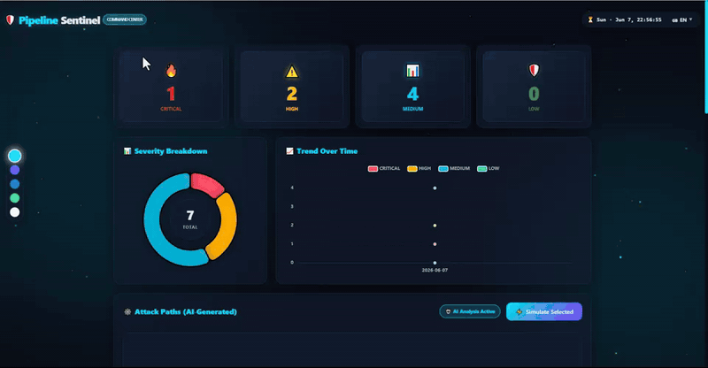
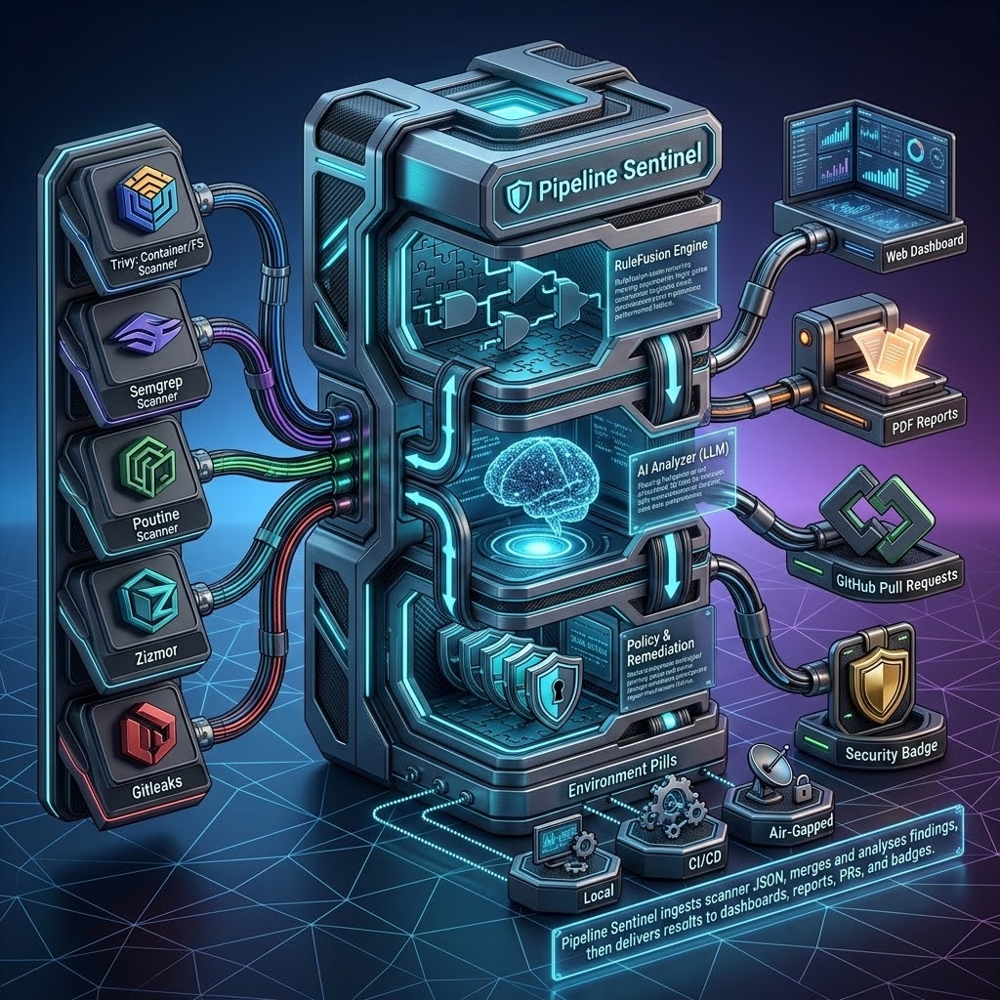
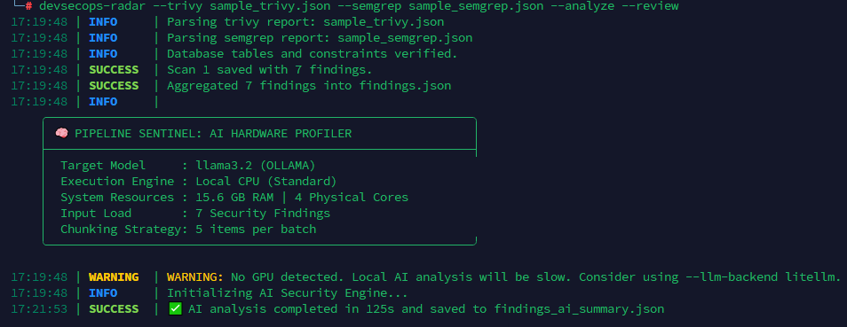
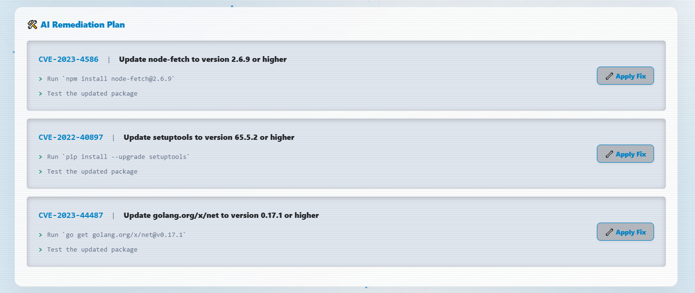
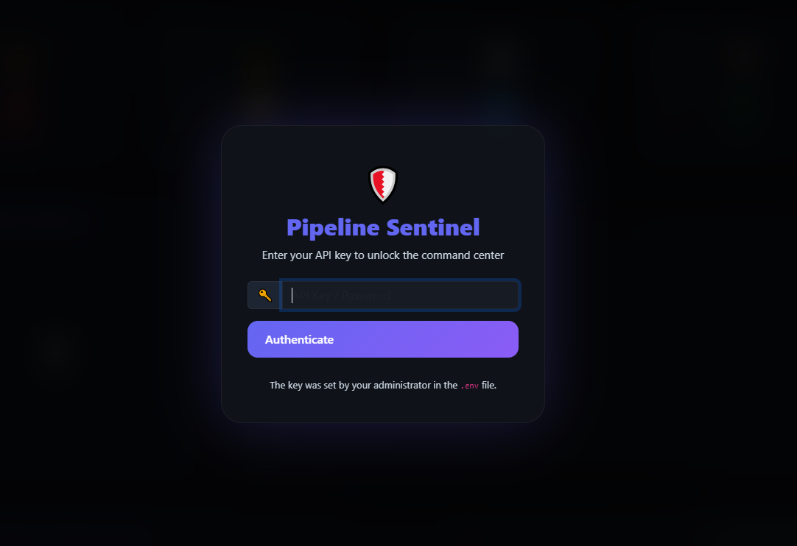
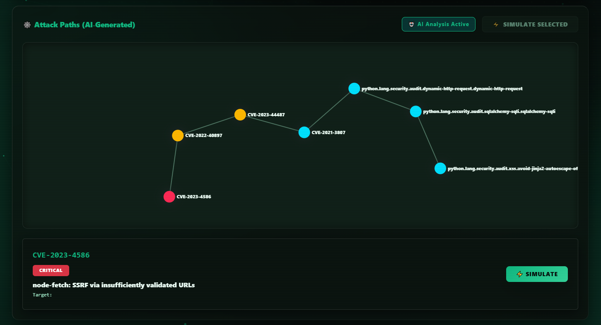
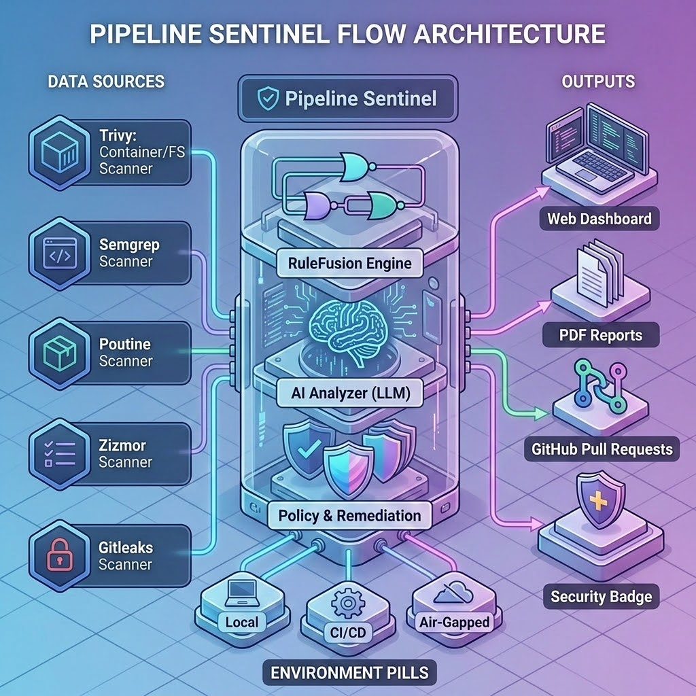

<div align="center">

# 🛡️ Pipeline Sentinel

### *مركز قيادة DevSecOps مفتوح المصدر — توحيد، تحليل، معالجة.*

[](https://pypi.org/project/devsecops-radar/)
[](LICENSE)
[](https://github.com/Mehrdoost/devsecops-radar/releases)
[](https://github.com/Mehrdoost/devsecops-radar/actions)
[](https://codecov.io/gh/Mehrdoost/devsecops-radar)
[](https://github.com/Mehrdoost/devsecops-radar/stargazers)

<br>

> 📖 **اقرأ هذا بلغات أخرى:** [English](README.md) | [Русский](README_ru.md) | [中文](README_zh.md)

<br>

*مخطط دائري لشدة الثغرات، رسم بياني لخط الاتجاه، مخطط مسار الهجوم (عقد قابلة للنقر)، عرض الطوبولوجيا، ملخص تنفيذي، ولوحة محاكاة الهجوم — كل ذلك دون الحاجة للاتصال بالإنترنت تماماً.*



</div>

---

<details>
<summary><b>📑 جدول المحتويات (انقر للتوسيع)</b></summary>

1. [ما هو Pipeline Sentinel؟ (شرح مبسط)](#-ما-هو-pipeline-sentinel-شرح-مبسط)
2. [لماذا تحتاجه؟](#-لماذا-تحتاجه)
3. [أين يتم تشغيله في شبكتك؟](#-أين-يتم-تشغيله-في-شبكتك)
4. [بنية تدفق الشبكة والطوبولوجيا](#-بنية-تدفق-الشبكة-والطوبولوجيا)
5. [معاينة لوحة التحكم](#-معاينة-لوحة-التحكم)
6. [البدء السريع](#-البدء-السريع)
7. [المتطلبات الأساسية](#-المتطلبات-الأساسية)
8. [التثبيت](#-التثبيت)
9. [طريقة الاستخدام (خطوة بخطوة)](#-طريقة-الاستخدام-خطوة-بخطوة)
10. [مرجع الأوامر الكامل](#-مرجع-الأوامر-الكامل)
11. [القدرات الأساسية](#-القدرات-الأساسية)
12. [قواعد المجتمع والتحديثات عبر الإنترنت](#-قواعد-المجتمع-والتحديثات-عبر-الإنترنت)
13. [محاكاة الهجوم وتحليل السيناريوهات](#-محاكاة-الهجوم-وتحليل-السيناريوهات)
14. [التحسينات الأمنية في الإصدار v0.4.5](#-التحسينات-الأمنية-في-الإصدار-v045)
15. [البنية الهيكلية للمشروع](#-البنية-الهيكلية-للمشروع)
16. [خارطة الطريق](#-خارطة-الطريق)
17. [الاختبارات والتكامل المستمر (CI)](#-الاختبارات-والتكامل-المستمر-ci)
18. [السياسة الأمنية](#-السياسة-الأمنية)
19. [المساهمة](#-المساهمة)
20. [قواعد السلوك](#-قواعد-السلوك)
21. [دعم التطوير](#-دعم-التطوير)
22. [المؤلفون](#-المؤلفون)
23. [الترخيص](#-الترخيص)

</details>

---

## 👨‍👩‍👧 ما هو Pipeline Sentinel؟ (شرح مبسط)

> **تخيل أن لديك عدة حراس أمن**، كل منهم يراقب باباً مختلفاً لبنى معينة. يصيح الجميع بما يجدونه بلغات مختلفة تماماً، وعليك الركض في كل مكان لتفهم ما يحدث.

يقوم **Pipeline Sentinel** بوضعهم جميعاً في غرفة واحدة، ويترجم تقاريرهم، ويعرض لك شاشة واحدة واضحة تلخص الصورة الكاملة. إنه يتصل بأدوات مثل **Trivy** (لفحص الحاويات)، و **Semgrep** (لفحص الكود)، و **Poutine** (لتدقيق خطوط أنابيب GitLab)، و **Zizmor** (لتأمين GitHub Actions)، و **Gitleaks** (للبحث عن الأسرار المسربة).

بدلاً من التنقيب في ملفات JSON متعددة ومعقدة، تحصل على **لوحة تحكم لمركز القيادة مذهلة تدعم الوضع الداكن**، تخبرك بالثغرات الحرجة، وكيف تتجه المخاطر، بل وكيف يمكن للمهاجم ربط عدة مشكلات صغيرة معاً لتكوين كارثة كبرى.

*اعتبره كـ **نظام كاميرات مراقبة أمنية لخط أنابيب CI/CD بالكامل** — يراقب كل شيء، وينبهك، ويقترح الإصلاحات، بل ويتيح لك محاكاة سلاسل الهجوم، كل ذلك دون الحاجة للاتصال بالإنترنت على الإطلاق.*

---

## 💥 لماذا تحتاجه؟

في عام 2026، أصبحت **هجمات سلاسل التوريد البرمجية** التهديد رقم #1 عالمياً. حتى الأدوات الأمنية نفسها مثل Trivy تم اختراقها سابقاً، ويقوم المهاجمون الآن بحقن الأكواد الخبيثة مباشرة في خطوط البناء والإنتاج. **لم يعد فحص الكود البرمجي وحده كافياً؛ يجب عليك فحص خط الأنابيب (Pipeline) الخاص بك أيضاً.**

**يمنحك Pipeline Sentinel:**
* 🎯 **تجميع موحد:** شاشة واحدة لجميع أدوات الفحص – توقف عن التوفيق بين ملفات السجلات المتناثرة.
* 🧠 **رؤى الذكاء الاصطناعي المبني على الرسوم البيانية:** ذكاء اصطناعي يفهم سلاسل الهجوم – *"سر مسرب + مكتبة قديمة = كارثة محققة"*.
* ⚡ **المعالجة التلقائية:** يقوم بإصلاح الملفات تلقائياً وفتح طلب سحب (Pull Request) مع نسخ احتياطي تلقائي عبر تمرير علامة برمجية واحدة.
* 👥 **وضع المراجعة البشرية:** واجهة تفاعلية خطوة بخطوة لفحص كل إصلاح قبل تطبيقه على بيئة الإنتاج الفعلية.
* 📊 **تقارير جاهزة للامتثال:** إنشاء ملخصات PDF احترافية فورية وجاهزة للمديرين أو المراجعين الماليين والأمنيين.
* ⚔️ **محاكاة الهجمات:** اختر بعض الثغرات ليقوم النظام تلقائياً بإنشاء نص برمجي تطبيقي (PoC) يوضح كيفية استغلالها.
* 🔒 **خصوصية مطلقة للشبكات المعزولة:** جاهز للعمل بنسبة 100% في البيئات المغلقة (Air-Gapped) لضمان عدم خروج البيانات خارج شبكتك.
* 🧙 **معالج الإعداد التفاعلي:** أمر واحد يقودك عبر عملية التهيئة والتثبيت المبدئي بالكامل.
* 🛒 **سوق القواعد:** جلب وتحديث قواعد الكشف المنسقة بعناية مباشرة من المجتمع.

---

## 📍 أين يتم تشغيله في شبكتك؟

تم تصميم Pipeline Sentinel ليكون **مرناً للغاية** — لتحدد أنت أين يناسبك نشره:

| وضع النشر والتثبيت | الخصائص والبيئة التشغيلية |
| :--- | :--- |
| 🖥️ **جهاز المطور المحلي** | تشغيل واجهة CLI ولوحة التحكم مباشرة على جهازك المحمول. مثالي للمختبرين الأمنيين والمطورين المستقلين للحصول على استجابة فورية ومحلية. |
| 🔧 **رانر خط أنابيب CI/CD** | دمج الأداة مباشرة في Jenkins أو GitLab CI أو GitHub Actions. إيقاف عملية البناء تلقائياً إذا تجاوزت الثغرات الحرجة سياساتك الأمنية المقررة. |
| 🏢 **مركز العمليات الأمنية المركزي** | النشر عبر Docker على خادم مركزي لجمع تجميع سجلات الفحص لفرق متعددة، مما يوفر رؤية موحدة تحت كونسول مشترك. |
| 🌐 **البيئات المعزولة (Air-Gapped)** | متوافق تماماً مع الأنظمة المغلقة. نشر حاوية Docker داخل شبكات معزولة دون أي اتصالات خارجية أو طلبات تتبع. |

---

## 🔍 بنية تدفق الشبكة والطوبولوجيا

### 🔄 دورة الحياة المنطقية للبيانات
يوضح المخطط الوظيفي أدناه كيفية انتقال مدخلات الفحص الخام عبر محرك التحليل الخاص بنا لتتم معالجتها وتوحيدها:

```mermaid
%%{init: {'theme': 'base', 'themeVariables': { 'primaryColor': '#1e1e2e', 'primaryTextColor': '#cdd6f4', 'primaryBorderColor': '#6c7086', 'lineColor': '#89b4fa', 'clusterBkg': '#181825', 'clusterBorder': '#585b70', 'fontFamily': 'system-ui, sans-serif', 'fontSize': '14px'}}}%%
flowchart LR
    %% 🎨 Class Definitions for a Beautiful UI
    classDef scanner fill:#24273a,stroke:#a6e3a1,stroke-width:2px,color:#a6e3a1
    classDef cliEngine fill:#24273a,stroke:#89b4fa,stroke-width:2px,color:#89b4fa
    classDef coreModule fill:#24273a,stroke:#f9e2af,stroke-width:2px,color:#f9e2af
    classDef web fill:#24273a,stroke:#94e2d5,stroke-width:2px,color:#94e2d5
    classDef dash fill:#24273a,stroke:#cba6f7,stroke-width:2px,color:#cba6f7
    classDef database fill:#1e1e2e,stroke:#f38ba8,stroke-width:2px,color:#f38ba8
    classDef external fill:#1e1e2e,stroke:#b4befe,stroke-width:2px,stroke-dasharray: 5 5,color:#b4befe

    subgraph ScannerInputs ["External Scanners"]
        T([Trivy]):::scanner
        S([Semgrep]):::scanner
        P([Poutine]):::scanner
        Z([Zizmor]):::scanner
        G([Gitleaks]):::scanner
    end

    subgraph CLI ["🛡️ CLI Engine (devsecops-radar)"]
        Plugins[[Plugin Discovery]]:::cliEngine
        Adapt[[Scanner Adapter]]:::cliEngine
        Norm[[Normalize & Validate]]:::cliEngine
        Risk{{compute_dynamic_risk_score}}:::cliEngine
    end

    subgraph Core ["Core Modules"]
        Analyzer{{🧠 AI Analyzer - Ollama/LiteLLM}}:::coreModule
        DB[(Database - SQLAlchemy)]:::database
        Remed([Auto-Fix & PR]):::coreModule
        RuleEng{{Rule Fusion Engine}}:::coreModule
        Report>Report Gen]:::coreModule
        SARIF>SARIF Export]:::coreModule
        CycloneDX>CycloneDX Export]:::coreModule
        Notifier([Jira/Asana Notifier]):::coreModule
        SBOM>SBOM Generator]:::coreModule
        AttackSim{{Attack Simulation}}:::coreModule
        RAG[/RAG Search/]:::coreModule
    end

    subgraph WebApp ["🌐 Web Application"]
        Flask(Flask App):::web
        Blueprints([Dashboard / Sentry / Attack-Paths / Topology / Summary]):::web
        Waitress(Waitress WSGI Server):::web
    end

    subgraph DashboardUI ["🖥️ Dashboard UI"]
        LiveFeed([Live Sentry Feed]):::dash
        Charts[/Severity & Trend Charts/]:::dash
        AttackGraph[/Attack Path Graph/]:::dash
        TopoGraph[/Topology Graph/]:::dash
        FindingsTable[/Findings Table/]:::dash
        RemedPlan[/AI Remediation Plan/]:::dash
        Policy[/Policy Status/]:::dash
        Export[/Report Modal/]:::dash
    end

    %% External & Outputs Data Definitions
    Out[(findings.json)]:::database
    PR[/PR / Patch File/]:::external
    Ext([External Services]):::external
    LocalAI{{Local AI Model}}:::external
    CommunityRepo[(Community Rules Repo)]:::external
    Sandbox{{Isolated Container}}:::external
    Syft([Syft CLI]):::external
    SentryBuffer[(In-Memory Buffer)]:::database
    TopoFile[(topology.json)]:::database

    %% Scanner data flow
    ScannerInputs -->|"Raw Reports"| Adapt
    Adapt --> Norm
    Norm --> Risk

    %% CLI output
    Risk -->|"findings.json"| Out
    Risk --> DB
    Risk --> Analyzer

    %% Core interactions
    Analyzer --> DB
    Analyzer --> Remed
    Remed -->|"git push/patch"| PR
    RuleEng -->|"Policy Check"| CLI
    RuleEng -->|"OPA Rego (beta)"| CLI

    %% Web app
    Out --> Flask
    DB --> Flask
    Flask --> Blueprints
    Blueprints --> Waitress
    Waitress --> DashboardUI

    %% External integrations
    Notifier -->|"Jira/Asana"| Ext
    Analyzer -->|"Ollama"| LocalAI
    RuleEng -->|"git clone"| CommunityRepo
    AttackSim -->|"Docker Sandbox"| Sandbox
    SBOM -->|"syft"| Syft
    
    %% UI details
    LiveFeed -.- SentryBuffer
    Charts --> DB
    AttackGraph --> Analyzer
    TopoGraph --> TopoFile
    RemedPlan --> Analyzer
    Policy --> RuleEng
    
    %% Split multiple targets for maximum compatibility
    Export --> Report 
    Export --> SARIF 
    Export --> CycloneDX

    %% Beautiful Subgraph Styling
    style ScannerInputs fill:#1e1e2e,stroke:#a6e3a1,stroke-width:2px,stroke-dasharray: 5 5,rx:10,ry:10
    style CLI fill:#1e1e2e,stroke:#3b82f6,stroke-width:2px,rx:10,ry:10
    style Core fill:#1e1e2e,stroke:#f59e0b,stroke-width:2px,rx:10,ry:10
    style WebApp fill:#1e1e2e,stroke:#10b981,stroke-width:2px,rx:10,ry:10
    style DashboardUI fill:#11111b,stroke:#a6e3a1,stroke-width:2px,rx:10,ry:10
```



### 🌐 رسم البنية التحتية التشغيلية
بعد المعالجة، يتم عرض النتائج المركزية الموحدة داخل مخطط الطوبولوجيا الذي يوضح الحدود الأمنية للشبكة، مما يعكس العلاقات التشغيلية بين أجزاء خط الأنابيب المختلفة:



---

## 📸 معاينة لوحة التحكم

*(شاهد العرض المتحرك في أعلى ملف README هذا لمشاهدة واجهة المستخدم الحية أثناء العمل!)*

---

## 🚀 البدء السريع

ابدأ التشغيل في 3 خطوات بسيطة فقط:

```bash
# 1. التثبيت من مستودعات PyPI
pip install devsecops-radar

# 2. تمرير بيانات الفحص (تتوفر عينات بيانات داخل المستودع)
devsecops-radar --trivy sample_trivy.json --semgrep sample_semgrep.json

# 3. تشغيل لوحة التحكم عبر الويب
devsecops-radar-web
```

افتح الرابط **http://localhost:8080** — مركز القيادة الموحد الخاص بك متاح الآن ويعرض عينات النتائج.

> [!TIP]
> 🧙 **هل تريد إعداداً إرشادياً بالكامل؟** قم بتشغيل المعالج التفاعلي:
> 
```bash
> devsecops-radar --wizard
> ```

---

## 📦 التثبيت

<details>
<summary><b>عرض جميع خيارات التثبيت (PyPI، Docker، المصدر، أمر واحد)</b></summary>
<br>

### الخيار 1 — عبر PyPI (موصى به)
```bash
pip install devsecops-radar
```

### الخيار 2 — من التعليمات البرمجية المصدرية
```bash
git clone https://github.com/Mehrdoost/devsecops-radar.git
cd devsecops-radar
pip install -e ".[dev]"
```

### الخيار 3 — عبر Docker
```bash
docker pull ghcr.io/mehrdoost/devsecops-radar:latest
docker run -p 8080:8080 ghcr.io/mehrdoost/devsecops-radar:latest
```
**ربط ملف النتائج الخاص بك بالحاوية:**
```bash
docker run -p 8080:8080 -v $(pwd)/findings.json:/data/findings.json ghcr.io/mehrdoost/devsecops-radar:latest
```
**أو استخدام Docker Compose:**
```bash
docker compose up
```

### 🧙 التثبيت بأمر واحد (curl)
```bash
curl -fsSL https://raw.githubusercontent.com/Mehrdoost/devsecops-radar/main/install.sh | bash
```
*يقوم هذا السكريبت بتثبيت تبعيات Python، وإعداد أداة Ollama، وسحب نموذج الذكاء الاصطناعي، ثم تشغيل معالج الإعداد تلقائياً.*

</details>

---

## 📋 المتطلبات الأساسية

> [!IMPORTANT]
> يعتمد Pipeline Sentinel على أدوات فحص خارجية لإنتاج تقارير JSON التي يستهلكها. يجب عليك تثبيت هذه الأدوات بشكل منفصل بناءً على احتياجاتك الأمنية.

- **مطلوب للفحص المحلي المغلق:** Trivy, Semgrep, Poutine, Zizmor, Gitleaks.
- **اختياري للتحسين:** Ollama (لتحليل الذكاء الاصطناعي)، Docker (لمحاكاة البيئة الآمنة)، OPA (لسياسات Rego البرمجية).

> 📖 **راجع ملف `PREREQUISITES.md` لمعرفة تفاصيل التثبيت الكاملة لهذه الأدوات.**

---

## 🧭 طريقة الاستخدام (خطوة بخطوة)

<details open>
<summary><b>1. تشغيل أدوات الفحص الأمني الخاصة بك</b></summary>
<br>

قم بإنشاء مخرجات بتنسيق JSON من أدواتك:
```bash
trivy image --format json -o trivy.json nginx:latest
semgrep --config=auto --json --output semgrep.json .
poutine scan ./repo --format json --output poutine.json
zizmor scan ./repo --output zizmor.json --format json
gitleaks detect --source . --report-format json --report-path gitleaks.json
```
</details>

<details open>
<summary><b>2. دمج وتوحيد النتائج عبر الـ CLI</b></summary>
<br>

```bash
devsecops-radar --trivy trivy.json --semgrep semgrep.json --poutine poutine.json --zizmor zizmor.json --gitleaks gitleaks.json
```
*ينتج عن هذا أمر ملف واحد باسم `findings.json` يحتوي على جميع النتائج مدمجة وموحدة التنسيق البنائي.*
</details>

<details open>
<summary><b>3. تصفح لوحة التحكم الويب</b></summary>
<br>

قم بتشغيل واجهة الويب لبدء تشغيل محرك التحليلات المركزي الخاص بك:
```bash
devsecops-radar-web
```

### 📊 بنية لوحة تحكم الويب التكتيكية
تقوم لوحة التحكم الحية ذات الصفحة الواحدة بتقسيم قياسات القيادة الأمنية إلى عناصر عملية عالية التأثير:

| مكون لوحة التحكم | نوع العرض المرئي في الواجهة | القيمة التشغيلية الأساسية |
| :--- | :--- | :--- |
| **تصنيف خطورة الثغرات** | مخططات دائرية ديناميكية | تتبع فوري لكثافة التعرض للمخاطر العالمية وإجمالي العدادات. |
| **الاتجاه بمرور الوقت** | خطوط زمنية بيانية مجمعة | رسوم بيانية للمسار التاريخي مستخرجة من سجلات الفحص المستمرة. |
| **أمن خطوط الأنابيب** | مصفوفة مخصصة لـ Poutine + Zizmor | تتبع دقيق لتحليل صحة سلاسل التوريد والعمليات الفوقية لمهام البناء. |
| **مخطط مسار الهجوم** | عقد برمجية تفاعلية بـ D3.js | خرائط تسلسلية قابلة للنقر توضح ترابط العيوب الهيكلية لبيئة النظام. |
| **الملخص التنفيذي** | ملخص غني بالسياق وتقييم المخاطر | ترجمة خوارزمية لاستخبارات التهديدات إلى مؤشرات جاهزة لاتخاذ القرار الإداري. |
| **جدول النتائج التفصيلي** | جداول مرقمة قابلة للبحث والاختيار | تحكم دقيق مصمم خصيصاً لعزل الكيانات المستهدفة لبدء محاكاة الهجوم. |

</details>

<details>
<summary><b>4. تفعيل تحليل الذكاء الاصطناعي المتقدم (اختياري)</b></summary>
<br>

```bash
ollama pull llama3.2:latest
devsecops-radar --trivy trivy.json --analyze
devsecops-radar-web
```
يقوم النموذج بتوليد ملف `findings_ai_summary.json` يحتوي على: `executive_summary` (الملخص التنفيذي)، و `risk_score` (درجة الخطورة الرقمية)، و `attack_paths` (مسارات الهجوم المقترنة بـ MITRE ATT&CK)، و `top_remediations` (أعلى توصيات المعالجة)، و `false_positives_likely` (النتائج المحتمل أن تكون خاطئة).



</details>

<details>
<summary><b>5. المعالجة التلقائية (مع مراجعة بشرية)</b></summary>
<br>

```bash
# تطبيق الإصلاحات والترقيعات تلقائياً
devsecops-radar --trivy trivy.json --analyze --fix

# مراجعة تفاعلية خطوة بخطوة
devsecops-radar --trivy trivy.json --analyze --fix --review
```


> [!NOTE]
> يتم نسخ جميع الملفات المعدلة احتياطياً بشكل آمن في المسار `~/.devsecops-radar/backups/`. تقوم الأداة تلقائياً بإنشاء فرع git جديد باسم `auto-fix` ودفعه للمراجعة والاعتماد.
</details>

<details>
<summary><b>6. فرض السياسات الأمنية (Gating)</b></summary>
<br>

قم بإنشاء ملف باسم `policy.json`:
```json
{
  "max_critical": 5, 
  "on_violation": "fail"
}
```

```bash
devsecops-radar --trivy trivy.json --policy policy.json
```
*إذا تجاوزت الثغرات الحرجة العدد 5، سينتهي الأمر برمز الخروج 1 لإيقاف البناء. يمكنك أيضاً استخدام سياسات OPA Rego عبر خيار (`--rego-policy`).*
</details>

<details>
<summary><b>7. إصدار تقارير الامتثال والمعايير الدولية</b></summary>
<br>

```bash
# تقرير PDF مع خرائط الامتثال للأطر الدولية
devsecops-radar --trivy trivy.json --analyze --compliance CIS --report cis-report.pdf

# تصدير النتائج بتنسيق SARIF لـ GitHub Code Scanning
devsecops-radar --trivy trivy.json --export-sarif report.sarif

# تصدير كـ CycloneDX SBOM لبيان مكونات البرمجيات
devsecops-radar --trivy trivy.json --export-cyclonedx report.cdx.json
```
</details>

<details>
<summary><b>8. إدراج شارة أمنية حية لمشروعك</b></summary>
<br>

اضف كود الشارة الأمنية الديناميكية داخل ملف README الخاص بمشروعك:
```markdown
[](https://github.com/Mehrdoost/devsecops-radar)
```
</details>

<details>
<summary><b>9. التكامل التلقائي مع مسارات Jira / Asana (جديد!)</b></summary>
<br>

قم بتعيين المتغيرات البيئية لإنشاء تذاكر المهام والعيوب الأمنية تلقائياً:
```bash
export JIRA_URL="https://your-domain.atlassian.net"
export JIRA_TOKEN="your-api-token"
devsecops-radar --trivy trivy.json --analyze --notify-jira

export ASANA_TOKEN="your-asana-token"
export ASANA_WORKSPACE="your-workspace-gid"
devsecops-radar --trivy trivy.json --analyze --notify-asana
```
</details>

---

## 📋 مرجع الأوامر الكامل

<details open>
<summary><b>انقر لتوسيع فئات الأوامر والخيارات البرمجية</b></summary>
<br>

### 🔎 الفواحص والمدخلات (Scanners)
| العلم البرمجي | الوصف المرجعي | مثال تطبيقي |
| :--- | :--- | :--- |
| `--trivy` | ملف تقرير Trivy JSON أو اسم حاوية الفحص | `--trivy` <kbd>results.json</kbd> أو <kbd>nginx:latest</kbd> |
| `--semgrep` | ملف تقرير Semgrep JSON أو مسار المجلد | `--semgrep` <kbd>results.json</kbd> أو <kbd>./src</kbd> |
| `--poutine` | ملف تقرير Poutine JSON أو مسار المستودع | `--poutine` <kbd>results.json</kbd> أو <kbd>./repo</kbd> |
| `--zizmor` | ملف تقرير Zizmor JSON أو مسار المستودع | `--zizmor` <kbd>results.json</kbd> أو <kbd>./repo</kbd> |
| `--gitleaks`| ملف تقرير Gitleaks JSON أو مسار المستودع | `--gitleaks` <kbd>results.json</kbd> أو <kbd>./repo</kbd> |
| `--rules` | مجلد محلي يحتوي على قواعد مخصصة بصيغة JSON | `--rules` <kbd>~/my-rules/</kbd> |
| `--topology`| مسار ملف طوبولوجيا الشبكة وعناصرها | `--topology` <kbd>topology.json</kbd> |

### 🧠 الذكاء الاصطناعي، السياسات والمعالجة
| العلم البرمجي | الوصف المرجعي | مثال تطبيقي |
| :--- | :--- | :--- |
| `--analyze` | تفعيل التحليل غير المتزامن عبر الـ LLM (يتطلب Ollama) | `--analyze` |
| `--llm-backend`| واجهة الربط: `ollama` (افتراضي) أو `litellm` | `--llm-backend` <kbd>litellm</kbd> |
| `--llm-model` | اسم نموذج الذكاء الاصطناعي المستهدف | `--llm-model` <kbd>gpt-4o-mini</kbd> |
| `--fix` | تطبيق الإصلاحات المقترحة تلقائياً (مع نسخ احتياطي) | `--fix` |
| `--review` | وضع المراجعة التفاعلية خطوة بخطوة | `--review` |
| `--policy` | ملف سياسة JSON لبوابة الفحص والتحكم | `--policy` <kbd>policy.json</kbd> |
| `--rego-policy`| ملف سياسة OPA Rego المتقدم | `--rego-policy` <kbd>policy.rego</kbd> |

### 📊 التقارير والتصدير
| العلم البرمجي | الوصف المرجعي | مثال تطبيقي |
| :--- | :--- | :--- |
| `--output` | ملف المخرجات الموحد (الافتراضي findings.json)| `--output` <kbd>merged.json</kbd> |
| `--report` | إصدار تقرير احترافي بصيغة PDF/JSON/HTML | `--report` <kbd>report.pdf</kbd> |
| `--export-sarif`| تصدير النتائج والمعالجات بصيغة القياس SARIF | `--export-sarif` <kbd>report.sarif</kbd> |
| `--export-cyclonedx`| تصدير تفاصيل المكونات البرمجية كـ CycloneDX | `--export-cyclonedx` <kbd>report.cdx</kbd> |
| `--compliance`| أطر الامتثال المدعومة: `CIS`, `PCI-DSS`, `ISO27001` | `--compliance` <kbd>CIS</kbd> |

### ⚙️ التكامل والإعداد التشغيلي
| العلم البرمجي | الوصف المرجعي | مثال تطبيقي |
| :--- | :--- | :--- |
| `--notify-jira` | إنشاء تذاكر مهام على Jira للثغرات الحرجة تلقائياً | `--notify-jira` |
| `--notify-asana`| إنشاء تذاكر مهام على Asana للثغرات الحرجة تلقائياً | `--notify-asana` |
| `--wizard` | معالج تشغيل وإعداد تفاعلي للمرة الأولى | `--wizard` |
| `--update-rules`| تحميل وتحديث قواعد الكشف المجتمعية دون إنترنت | `--update-rules` |

<br>

> [!TIP]
> **`devsecops-radar-web` — خيارات تشغيل خادم الويب**

```bash
devsecops-radar-web                         # التشغيل على الرابط الافتراضي http://localhost:8080
FINDINGS_FILE=my.json devsecops-radar-web   # استخدام ملف نتائج مخصص
PIPELINE_API_KEY=secret devsecops-radar-web # تفعيل مفتاح المصادقة والحماية للـ API
```


</details>

---

## ✨ القدرات الأساسية

### 🔌 محرك ذكي لاستيعاب الفواحص المتعددة
* **بنية برمجية قابلة للتوصيل:** واجهات فك تشفير برمجية نمطية للغاية تستقبل بسلاسة البيانات الهيكلية من Trivy و Semgrep و Poutine و Zizmor و Gitleaks.
* **طبقة دمج السياسات الهجينة RuleFusion:** تقييم ديناميكي يدمج قواعد الحماية المحلية المخصصة مع تغذيات مستودعات القواعد المجتمعية المحدثة.
* **أمثلة لتسريع سجلات الفحص:** إدارة قاعدة البيانات وإجراء الاستعلامات التاريخية بفضل قاعدة SQLAlchemy لدعم معالجة وحصر ملايين التهديدات في أجزاء من الثانية.

### 🧠 ذكاء اصطناعي متقدم ومعالجة نشطة
* **نماذج لغوية معززة السياق بشكل غير متزامن:** توافق برمي كامل مع محركات (Ollama/LiteLLM) لربط إعدادات الثغرات الهيكلية بمصفوفات MITRE ATT&CK للتهديدات الحقيقية.
* **مسارات الترقيع التفاعلية الذكية:** دعم خيارات ترقيع ومعالجة ذكية صامتة للأكواد الخبيثة (`--fix`) متوازنة مع بوابات تحقق بشرية دقيقة لخطوط الامتثال (`--review`).
* **تقييم المخاطر المستند للمحيط الخارجي:** حسابات تحليلية متقدمة تدمج مستويات الخطورة الأصلية للثغرة مع مستوى التعرض الخارجي وقابلية الوصول الديناميكي للمهاجم.

### 🛡️ حوكمة السياسات البرمجية وسلاسل التوريد
* **إطار عمل السياسات كأكواد برمجية (Policy-as-Code):** فرض بوابات تحقق عبر ملفات JSON محلية مبسطة أو نصوص برمجة معقدة ومتقدمة عبر Open Policy Agent (OPA) Rego.
* **بيان مكونات البرمجيات (SBOM):** إنشاء تقارير أصول وتكوين كاملة للامتثال البرمجي كـ CycloneDX مدعومة بطبقة حجب مرنة وعالية الكفاءة للثغرات VEX.
* **سرية تشغيلية مطلقة للشبكات المعزولة:** جميع الأصول الثابتة والذكاء الاصطناعي تعمل محلياً بالكامل لضمان تشغيل حلقات البيانات دون أي اتصالات مرجعية خارجية.

---

## 🌍 قواعد المجتمع والتحديثات عبر الإنترنت

يتميز Pipeline Sentinel بسوق قواعد تشغيلي مدفوع ومدعوم من المجتمع يقع في مستودع مستقل: `devsecops-radar-rules`.

**كيف يعمل الآلية:**
يحتوي المستودع على ملفات قواعد مخصصة بصيغة JSON لجميع الفواحص المدعومة. يمكنك سحب وتحديث شبكة الأمان الخاصة بك بأمر واحد:
```bash
devsecops-radar --update-rules
```
يتم حفظ ملفات القواعد محلياً في المسار `~/.devsecops-radar/community-rules/`. لتفعيلها مع نتائج فحص أدواتك:
```bash
devsecops-radar --trivy scan.json --rules ~/.devsecops-radar/community-rules/
```

> [!NOTE]
> يمكنك إعادة توجيه المستودع ليعمل مع مستودع القواعد الخاص بشركتك عبر تعيين المتغير البيئي `COMMUNITY_RULES_REPO`!

---

## ⚔️ محاكاة الهجوم وتحليل السيناريوهات

**بدء محاكاة اختراق تفاعلية ومتقدمة مباشرة من لوحة التحكم:**
1. حدد خانات الاختيار بجانب الثغرات الأمنية التي ترغب في التحقق منها.
2. انقر فوق الزر **“⚡ Simulate Selected”**.
3. ستظهر نافذة منبثقة تعرض نصاً برمجياً تنفيذياً هجومياً تلقائياً (`bash`)، ووصفاً لسلسلة الاستغلال المركبة، ومخرجات المحاكاة (إذا كانت بيئة Sandbox متوفرة).

*(يمكنك أيضاً النقر فوق أي عقدة أمنية داخل مخطط مسار الهجوم واختيار **“Simulate this attack”**)*.



---

## ✨ جديد الإصدار v0.4.5

- **تغذية Sentry الحية** – تظهر نتائج CI/CD بشكل تلقائي في الوقت الفعلي  
- **حالة الماسحات** – تعرّف على الأدوات المثبتة والجاهزة  
- **خطة الإصلاح بالذكاء الاصطناعي** – تعليمات الإصلاح خطوة بخطوة مباشرة في لوحة التحكم  
- **حالة السياسة** – مؤشر انتهاك حي من `policy.json`  
- **رسم بياني للطوبولوجيا** – خريطة تفاعلية لأصول البنية التحتية  
- **فلاتر متقدمة** – تصفية حسب الأداة أو الخطورة أو الهدف أو الوصف  
- **Jira و Asana بنقرة واحدة** – أرسل النتائج مباشرة من نافذة التقرير المنبثقة  
- **السمة التلقائية** – تتبع تفضيلات نظام التشغيل (فاتح/داكن)  
- **جميع أعلام CLI أصبحت فعّالة** – `--export-sarif` و`--export-cyclonedx` و`--compliance` و`--notify-jira` و`--notify-asana` و`--update-rules` و`--rego-policy`  
- **تقسيم النصوص حسب الرموز المميزة للذكاء الاصطناعي** – يمنع تجاوز السياق للنماذج المحلية  
- **تقييم المخاطر المرجّح** – تعكس النتائج المدمجة الكثافة الفعلية للنتائج  
- **إعادة تنظيم المخططات** – لا مزيد من المسارات المكررة، بنية أنظف  
- **تدقيق صارم للتنسيق والأنواع** – صفر أخطاء من Ruff/mypy

---

## 🏗️ البنية الهيكلية للمشروع

```text
devsecops_radar/
├── cli/            # نقطة دخول الـ CLI – اكتشاف الإضافات، فرض السياسات، الإصلاح النشط
├── core/           # محرك دمج القواعد RuleFusion، قاعدة البيانات (SQLAlchemy)، طبقة الـ LLM
├── scanners/       # فئات الفواحص القابلة للتوصيل (ترث من الفئة الأساسية ScannerPlugin)
├── plugins/        # الفئة المجردة الأساسية لنقاط فحص أدوات الأمان وتسجيلها
└── web/            # لوحة تحكم Flask (تصميم نمطي، متوافق مع معايير الامتثال لوصول الويب WCAG 2.1 AA)
    ├── dashboard/  # مسارات وواجهات التحكم الرئيسية ومكونات الـ HTML المدمجة
    ├── attack_paths/
    ├── topology/
    ├── summary/
    └── sentry/     # وكيل الـ Webhook الفوري لربط وتوصيل عمليات خطوط الـ CI/CD
```



---

## 🗺️ خارطة الطريق

| مرحلة التطوير | الميزات والقدرات المستهدفة | حالة الاكتمال |
| :--- | :--- | :--- |
| ✅ **المرحلة 1** | محرك الفحص متعدد المصادر، تحليل الذكاء الاصطناعي غير المتزامن، تكامل إجراءات خطوط بناء GitHub Actions | مكتمل |
| ✅ **المرحلة 2** | طوبولوجيا مسارات الهجوم المركبة، فرض بوابات الامتثال كأكواد برمجية، معالجة تلقائية وتقارير دولية | مكتمل |
| ✅ **المرحلة 3** | لوحة تحكم ويب متقدمة، تقسيم ترقيم البيانات الضخمة ORM، توليد ملفات SBOM، تقييم سهولة الوصول، دعم Gitleaks | مكتمل |
| ✅ **المرحلة 4** | محاكاة هجمات تفاعلية عالية الدقة، طبقة حجب ثغرات الـ VEX، دعم الذكاء الاصطناعي غير المتزامن، مخرجات SARIF المعيارية | مكتمل |
| 🔲 **المرحلة 5** | برمجيات خفيفة الوزن تعتمد على eBPF لتوفير حماية نشطة على مستوى نواة نظام التشغيل أثناء التشغيل الفعلي | مخطط له |
| 🔲 **المرحلة 5** | سوق وقواعد بيانات مفتوحة وموسعة للشركات تعتمد بالكامل على معايير تمثيل YAML الدولية | مخطط له |
| 🔲 **المرحلة 5** | مساعد أمني ذكي ومدمج بالكامل لمراجعة طلبات السحب تلقائياً عند مستودعات الأكواد (GitHub App) | مخطط له |

> [!NOTE]
> يرجى زيارة [قائمة القضايا والمقترحات المفتوحة](https://github.com/Mehrdoost/devsecops-radar/issues) للاطلاع على تفاصيل ومناقشات الميزات الجاري تطويرها.

---

## 🧪 الاختبارات والتكامل المستمر (CI)

يخضع مشروع Pipeline Sentinel لاختبارات صارمة وشاملة لضمان استقراره الكامل وملاءمته لبيئات النشر والإنتاج الكبرى عالية الأحمال.
* **الاختبارات الوحدوية والتكاملية:** تغطية أكثر من 23 سيناريو فحص واختبار دقيق، تشمل محركات التحليل، وبوابات اتخاذ القرار التلقائية، وسلامة قاعدة البيانات، وتفاعل الـ CLI.
* **التكامل المستمر التلقائي:** أي عمليات رفع للأكواد (Push) أو طلبات دمج (Pull Request) تفعل تلقائياً مسارات حماية الأكواد ومراجعتها فورا عبر (`ruff` و `mypy`) و `pytest-cov` من خلال خطوط بناء GitHub Actions.

لتشغيل عمليات الفحص والاختبار بالكامل محلياً:
```bash
pip install -e ".[dev]"
pip install pytest pytest-flask ruff
pytest tests/ -v --cov=devsecops_radar --cov-report=term-missing
ruff check .
mypy .
```

---

## 🤝 السياسة الأمنية والامتثال المجتمعي

* **الإبلاغ عن الثغرات الأمنية:** نحن نولي أمن برمجياتنا أعلى درجات الاهتمام. إذا رصدت أي ثغرة أمنية أثناء استخدام النظام، يرجى التواصل معنا بشكل خاص وسري للغاية لحماية المستخدمين. راجع ملف Security Policy لمزيد من التفاصيل.
* **دليل المساهمة:** لا غنى للمشروع عن عقول المطورين المبدعين في مجتمعنا! يرجى قراءةContributing Guide بعناية قبل بدء رفع مساهماتك البرمجية.
* **قواعد السلوك العالمية:** يلتزم هذا المشروع بدعم ميثاق المساهمين لبناء بيئة عمل وصداقة برمجية صحية وعادلة للجميع.

---

## ⚡ دعم التطوير

إذا كنت تؤمن بالقيمة المضافة لهذا المشروع المفتوح المصدر، أو ساهم بشكل فعال في حماية خطوط بناء برمجيات فريقك، يمكنك التعبير عن تقديرك ودعمك المالي لفريق التطوير عبر إرسال مساهمات مشفرة:

**[🔗 التبرع بعملة USDC (عبر شبكة Polygon)](https://polygonscan.com/address/0x6b7c1c572D45575Fa5409CB52F25B750B3097c8b)** <sub>`0x1234...5678`</sub> · <sub></sub>

---

## 👨‍💻 المؤلفون

**ReverseForge** — ( Mehrdoost و Mi0r4 )  

[](https://github.com/ReverseForge) 
[](https://github.com/Mehrdoost) 
[](https://github.com/miora-sora) 

---

## 📜 الترخيص

مرخص بالكامل تحت مظلة رخصة **MIT الدولية** — لمزيد من التفاصيل يرجى قراءة بند الترخيص المرفق [LICENSE](LICENSE).

<div align="center">
<br>

⭐ **إذا ساعدتك هذه الأداة في تسليم برمجياتك بشكل أكثر أماناً وثقة، فلا تبخل علينا بنجمة (Star) — فوجودها يدعم استمرارنا في العطاء المفتوح.**

</div>