<div align="center">

# 🛡️ Pipeline Sentinel

### *Центр управления DevSecOps с открытым исходным кодом — Объединение, Анализ, Исправление.*

[](https://pypi.org/project/devsecops-radar/)
[](LICENSE)
[](https://github.com/Mehrdoost/devsecops-radar/releases)
[](https://github.com/Mehrdoost/devsecops-radar/actions)
[](https://codecov.io/gh/Mehrdoost/devsecops-radar)
[](https://github.com/Mehrdoost/devsecops-radar/stargazers)

<br>

> 📖 **Читать на других языках:** [English](README.md) | [中文](README_zh.md) | [العربية](README_ar.md)

<br>

*Круговая диаграмма критичности, график трендов, граф путей атак (кликабельные узлы), просмотр топологии, резюме для руководства и панель симуляции атак — полностью автономно (offline).*


</div>

---

<details>
<summary><b>📑 Содержание (Нажмите для раскрытия)</b></summary>

1. [Что такое Pipeline Sentinel? (Простыми словами)](#-что-так-pipeline-sentinel-простыми-словами)
2. [Почему это необходимо?](#-почему-это-необходимо)
3. [Где запускать в вашей сети?](#-где-запускать-в-вашей-сети)
4. [Архитектура потоков данных и топология](#-архитектура-потоков-данных-и-топология)
5. [Обзор панели управления](#-обзор-панели-управления)
6. [Быстрый старт](#-быстрый-старт)
7. [Требования](#-требования)
8. [Установка](#-установка)
9. [Пошаговое руководство](#-пошаговое-руководство)
10. [Полный справочник команд](#-полный-справочник-команд)
11. [Ключевые возможности](#-ключевые-возможности)
12. [Правила сообщества и обновления онлайн](#-правила-сообщества-и-обновления-онлайн)
13. [Симуляция атак и анализ сценариев](#-симуляция-атак-и-анализ-сценариев)
14. [Улучшения безопасности в v0.4.4](#-улучшения-безопасности-в-v044)
15. [Архитектура проекта](#-архитектура-проекта)
16. [План развития (Roadmap)](#-план-развития-roadmap)
17. [Тестирование и CI](#-тестирование-и-ci)
18. [Политика безопасности](#-политика-безопасности)
19. [Участие в проекте](#-участие-в-проекте)
20. [Кодекс поведения](#-кодекс-поведения)
21. [Поддержка разработки](#-поддержка-разработки)
22. [Авторы](#-авторы)
23. [Лицензия](#-лицензия)

</details>

---

## 👨‍👩‍👧 Что такое Pipeline Sentinel? (Простыми словами)

> **Представьте, что у вас есть несколько охранников**, каждый из которых следит за отдельной дверью здания. Они выкрикивают свои отчеты на совершенно разных языках, и вам приходится бегать повсюду, чтобы понять, что происходит.

**Pipeline Sentinel** собирает их всех в одной комнате, переводит их отчеты и выводит на один четкий экран всю картину целиком. Он подключается к таким инструментам, как **Trivy** (проверка контейнеров), **Semgrep** (сканирование кода), **Poutine** (аудит конвейеров GitLab), **Zizmor** (защита GitHub Actions) и **Gitleaks** (поиск утечек секретов).

Вместо того чтобы копаться в десятках разрозненных JSON-файлов, вы получаете **великолепную темную панель управления**, которая показывает критические уязвимости, тренды рисков и то, как злоумышленник может связать несколько мелких ошибок в одну большую катастрофу.

*Думайте об этом как о **системе видеонаблюдения для всего вашего CI/CD-конвейера** — она следит за всем, предупреждает, предлагает исправления и даже позволяет симулировать цепочки атак локально без доступа к интернету.*

---

## 💥 Почему это необходимо?

В 2026 году **атаки на цепочки поставок (Supply Chain Attacks)** стали угрозой №1. Были случаи компрометации самих инструментов сканирования (таких как Trivy), и злоумышленники теперь внедряют вредоносный код прямо в конвейеры сборки. **Больше нельзя сканировать только код; вы обязаны сканировать сам конвейер.**

**Pipeline Sentinel дает вам:**
* 🎯 **Единую агрегацию:** Один экран для всех сканеров – забудьте о ручном разборе логов.
* 🧠 **Графовую аналитику на базе ИИ:** ИИ, который понимает цепочки атак – *"Утечка секретов + старая библиотека = неминуемая катастрофа"*.
* ⚡ **Автоматическое исправление:** Автоматически патчит файлы и открывает Pull Request (с созданием бэкапов) с помощью одного флага.
* 👥 **Режим ручной проверки:** Пошаговый интерактивный интерфейс для анализа каждого исправления перед его применением в продакшене.
* 📊 **Отчеты о соответствии стандартам:** Мгновенная генерация профессиональных PDF-отчетов для аудиторов, менеджеров и регуляторов.
* ⚔️ **Симуляцию атак:** Отметьте галочками найденные угрозы, и система автоматически создаст рабочий скрипт эксплойта (PoC) для демонстрации риска.
* 🔒 **Конфиденциальность в изолированной среде:** На 100% готов к работе в закрытых контурах (Air-Gapped). Ваши данные никогда не покинут локальную сеть.
* 🧙 **Интерактивный мастер настройки:** Одна команда проведет вас через весь процесс инициализации и первичной конфигурации.
* 🛒 **Маркетплейс правил:** Динамическое получение и обновление проверенных правил обнаружения напрямую от сообщества.

---

## 📍 Где запускать в вашей сети?

Pipeline Sentinel спроектирован так, чтобы быть **максимально гибким** — вы сами решаете, где его развернуть:

| Режим развертывания | Операционный профиль и применение |
| :--- | :--- |
| 🖥️ **Локальная машина** | Запуск CLI и веб-панели прямо на ноутбуке. Идеально подходит для пентестеров или разработчиков для мгновенного получения результатов. |
| 🔧 **Раннеры конвейера CI/CD** | Интеграция напрямую в скрипты Jenkins, GitLab CI или GitHub Actions. Автоматическая остановка сборки (Fail-Build), если критические риски нарушают политики безопасности. |
| 🏢 **Центральный сервер SOC** | Развертывание через Docker на выделенном сервере для сбора истории сканирований от множества команд, объединяя видимость в общую консоль. |
| 🌐 **Закрытые контуры (Air-Gapped)** | Полная совместимость с изолированными сетями. Запуск автономного Docker-образа без внешних сетевых вызовов и обращений к трекерам. |

---

## 🔍 Архитектура потоков данных и拓扑结构

### 🔄 Логический жизненный цикл данных
Функциональная схема ниже показывает, как необработанные результаты сканеров проходят через наш аналитический движок для нормализации и централизации:

```mermaid
graph LR
    subgraph Scanners [Источники данных]
        T[Сканирование Trivy] 
        S[Сканирование Semgrep] 
        P[Сканирование Poutine] 
        Z[Сканирование Zizmor] 
        G[Сканирование Gitleaks]
    end

    Scanners --->|Сырые отчеты| CLI(🛡️ Движок devsecops-radar CLI)
    CLI --->|Нормализация и дедупликация| Out[findings.json]
    Out ---> Web(📊 Flask веб-приложение)
    Web ---> UI[🌐 Современная консоль управления в браузере]

    style CLI fill:#1e1e2e,stroke:#3b82f6,stroke-width:2px,color:#cdd6f4
    style Web fill:#1e1e2e,stroke:#10b981,stroke-width:2px,color:#cdd6f4
    style Out fill:#181825,stroke:#fab387,stroke-width:1px,color:#a6e3a1
    style UI fill:#11111b,stroke:#a6e3a1,stroke-width:2px,color:#cdd6f4
```



### 🌐 Операционное картирование инфраструктуры
После обработки нормализованные данные визуализируются на карте топологии с учетом сетевых границ, наглядно демонстрируя взаимосвязи между компонентами конвейера:


---

## 📸 Обзор панели управления

*(Анимированное демо интерфейса в действии доступно в самом верху этого файла README!)*

---

## 🚀 Быстрый старт

Разверните систему всего за 3 простых шага:

```bash
# 1. Установка из репозитория PyPI
pip install devsecops-radar

# 2. Загрузка данных сканирования (примеры файлов доступны в репозитории)
devsecops-radar --trivy sample_trivy.json --semgrep sample_semgrep.json

# 3. Запуск веб-панели управления
devsecops-radar-web
```

Откройте адрес **http://localhost:8080** — ваш единый центр управления запущен и готов к работе с демонстрационными данными.

> [!TIP]
> 🧙 **Хотите пройти пошаговую настройку?** Запустите интерактивный мастер:
> 
```bash
> devsecops-radar --wizard
> ```

---

## 📦 Установка

<details>
<summary><b>Посмотреть все варианты установки (PyPI, Docker, из исходников, скрипт одной команды)</b></summary>
<br>

### Вариант 1 — Через PyPI (Рекомендуемый)
```bash
pip install devsecops-radar
```

### Вариант 2 — Из исходного кода
```bash
git clone https://github.com/Mehrdoost/devsecops-radar.git
cd devsecops-radar
pip install -e ".[dev]"
```

### Вариант 3 — Через Docker
```bash
docker pull ghcr.io/mehrdoost/devsecops-radar:latest
docker run -p 8080:8080 ghcr.io/mehrdoost/devsecops-radar:latest
```
**Монтирование вашего собственного файла результатов:**
```bash
docker run -p 8080:8080 -v $(pwd)/findings.json:/data/findings.json ghcr.io/mehrdoost/devsecops-radar:latest
```
**Или использование Docker Compose:**
```bash
docker compose up
```

### 🧙 Установка одной командой (curl)
```bash
curl -fsSL https://raw.githubusercontent.com/Mehrdoost/devsecops-radar/main/install.sh | bash
```
*Этот скрипт автоматически установит зависимости Python, развернет Ollama, загрузит модель ИИ и запустит мастер конфигурации.*

</details>

---

## 📋 Требования

> [!IMPORTANT]
> Pipeline Sentinel полагается на внешние инструменты безопасности для генерации JSON-отчетов. Вам необходимо установить эти инструменты отдельно в соответствии с вашими задачами.

- **Обязательно для локального сканирования:** Trivy, Semgrep, Poutine, Zizmor, Gitleaks.
- **Опционально для расширения функций:** Ollama (анализ ИИ), Docker (песочница для симуляций), OPA (политики на языке Rego).

> 📖 **Полные инструкции по установке этих утилит см. в документе `PREREQUISITES.md`.**

---

## 🧭 Пошаговое руководство

<details open>
<summary><b>1. Запуск ваших сканеров безопасности</b></summary>
<br>

Сгенерируйте выходные данные в формате JSON из используемых вами утилит:
```bash
trivy image --format json -o trivy.json nginx:latest
semgrep --config=auto --json --output semgrep.json .
poutine scan ./repo --format json --output poutine.json
zizmor scan ./repo --output zizmor.json --format json
gitleaks detect --source . --report-format json --report-path gitleaks.json
```
</details>

<details open>
<summary><b>2. Объединение результатов через CLI</b></summary>
<br>

```bash
devsecops-radar --trivy trivy.json --semgrep semgrep.json --poutine poutine.json --zizmor zizmor.json --gitleaks gitleaks.json
```
*В результате будет создан один нормализованный файл `findings.json` без дубликатов.*
</details>

<details open>
<summary><b>3. Просмотр веб-панели управления</b></summary>
<br>

Запустите веб-оболочку для старта централизованного аналитического движка:
```bash
devsecops-radar-web
```

### 📊 Архитектура тактической веб-консоли
Интерактивная одностраничная панель управления распределяет телеметрию по высокоэффективным операционным зонам:

| Компонент панели | Тип визуализации интерфейса | Основная операционная ценность |
| :--- | :--- | :--- |
| **Распределение критичности** | Динамические круговые диаграммы | Мгновенный контроль плотности глобальных угроз и общих счетчиков. |
| **Тренды во времени** | Графики исторических изменений | Наглядные графики траектории рисков, построенные на основе постоянных логов. |
| **Безопасность конвейеров** | Специализированная матрица Poutine + Zizmor | Микротелеметрия для анализа здоровья цепочки поставок и мета-воркфлоу. |
| **Граф путей атак** | Интерактивные узлы силы D3.js | Кликабельное картирование цепочек связей между архитектурными дефектами. |
| **Резюме для руководства** | Контекстный обзор и скоринг рисков | Алгоритмический перевод технической киберазведки в бизнес-метрики. |
| **Таблица результатов** | Постраничные таблицы с чекбоксами | Гранулярный выбор конкретных сущностей для их отправки на симуляцию атак. |

</details>

<details>
<summary><b>4. Включение ИИ-анализа (Опционально)</b></summary>
<br>

```bash
ollama pull llama3.2:latest
devsecops-radar --trivy trivy.json --analyze
devsecops-radar-web
```
Локальная языковая модель создаст файл `findings_ai_summary.json`, содержащий: `executive_summary` (резюме для руководства), `risk_score` (оценка степени риска), `attack_paths` (пути уязвимостей с привязкой к MITRE ATT&CK), `top_remediations` (главные рекомендации по устранению) и `false_positives_likely` (вероятные ложные срабатывания).


</details>

<details>
<summary><b>5. Автоматическое исправление (с верификацией)</b></summary>
<br>

```bash
# Применить исправления автоматически
devsecops-radar --trivy trivy.json --analyze --fix

# Интерактивная пошаговая проверка изменений
devsecops-radar --trivy trivy.json --analyze --fix --review
```
> [!NOTE]
> Все измененные файлы бэкапятся в каталог `~/.devsecops-radar/backups/`. Инструмент автоматически создаст новую ветку git `auto-fix` и отправит ее на проверку.
</details>

<details>
<summary><b>6. Контроль политик (Gating)</b></summary>
<br>

Создайте файл политик `policy.json`:
```json
{
  "max_critical": 5, 
  "on_violation": "fail"
}
```

```bash
devsecops-radar --trivy trivy.json --policy policy.json
```
*Если количество критических уязвимостей превысит 5, команда завершится с кодом ошибки 1, остановив конвейер. Также поддерживаются комплексные политики OPA Rego через флаг (`--rego-policy`).*
</details>

<details>
<summary><b>7. Генерация отчетов о соответствии стандартам</b></summary>
<br>

```bash
# PDF-отчет с привязкой к международным стандартам безопасности
devsecops-radar --trivy trivy.json --analyze --compliance CIS --report cis-report.pdf

# Экспорт результатов в формате SARIF для GitHub Code Scanning
devsecops-radar --trivy trivy.json --export-sarif report.sarif

# Экспорт спецификации ресурсов в формате CycloneDX SBOM
devsecops-radar --trivy trivy.json --export-cyclonedx report.cdx.json
```
</details>

<details>
<summary><b>8. Динамический бейдж безопасности для вашего проекта</b></summary>
<br>

Вставьте код динамического статуса безопасности прямо в файл README вашего проекта:
```markdown
[](https://github.com/Mehrdoost/devsecops-radar)
```
</details>

<details>
<summary><b>9. Автоматическая интеграция с Jira / Asana (Новинка!)</b></summary>
<br>

Настройте переменные окружения для автоматического создания задач по уязвимостям:
```bash
export JIRA_URL="https://your-domain.atlassian.net"
export JIRA_TOKEN="your-api-token"
devsecops-radar --trivy trivy.json --analyze --notify-jira

export ASANA_TOKEN="your-asana-token"
export ASANA_WORKSPACE="your-workspace-gid"
devsecops-radar --trivy trivy.json --analyze --notify-asana
```
</details>

---

## 📋 Полный справочник команд

<details open>
<summary><b>Нажмите для раскрытия категорий команд и флагов</b></summary>
<br>

### 🔎 Сканеры и входные данные
| Флаг команды | Описание | Пример использования |
| :--- | :--- | :--- |
| `--trivy` | JSON-файл отчета Trivy или имя образа | `--trivy` <kbd>results.json</kbd> или <kbd>nginx:latest</kbd> |
| `--semgrep` | JSON-файл отчета Semgrep или путь к каталогу | `--semgrep` <kbd>results.json</kbd> или <kbd>./src</kbd> |
| `--poutine` | JSON-файл отчета Poutine или путь к репозиторию | `--poutine` <kbd>results.json</kbd> или <kbd>./repo</kbd> |
| `--zizmor` | JSON-файл отчета Zizmor или путь к репозиторию | `--zizmor` <kbd>results.json</kbd> или <kbd>./repo</kbd> |
| `--gitleaks`| JSON-файл отчета Gitleaks или путь к репозиторию | `--gitleaks` <kbd>results.json</kbd> или <kbd>./repo</kbd> |
| `--rules` | Локальный каталог с пользовательскими JSON-правилами | `--rules` <kbd>~/my-rules/</kbd> |
| `--topology`| Путь к файлу топологии сети | `--topology` <kbd>topology.json</kbd> |

### 🧠 ИИ, Политики и Исправления
| Флаг команды | Описание | Пример использования |
| :--- | :--- | :--- |
| `--analyze` | Включить асинхронный анализ через LLM (требуется Ollama) | `--analyze` |
| `--llm-backend`| Провайдер ИИ: `ollama` (по умолчанию) или `litellm` | `--llm-backend` <kbd>litellm</kbd> |
| `--llm-model` | Имя используемой языковой модели | `--llm-model` <kbd>gpt-4o-mini</kbd> |
| `--fix` | Автоматически применить исправления ИИ (безопасно) | `--fix` |
| `--review` | Интерактивный режим пошагового исправления | `--review` |
| `--policy` | JSON-файл базовых политик для шлюза контроля | `--policy` <kbd>policy.json</kbd> |
| `--rego-policy`| Файл продвинутых политик OPA Rego | `--rego-policy` <kbd>policy.rego</kbd> |

### 📊 Отчеты и Экспорт данных
| Флаг команды | Описание | Пример использования |
| :--- | :--- | :--- |
| `--output` | Имя результирующего JSON-файла (default: findings.json)| `--output` <kbd>merged.json</kbd> |
| `--report` | Генерация профессионального отчета PDF/JSON/HTML | `--report` <kbd>report.pdf</kbd> |
| `--export-sarif`| Экспорт результатов сканирования в формат SARIF | `--export-sarif` <kbd>report.sarif</kbd> |
| `--export-cyclonedx`| Экспорт спецификации ресурсов в формат CycloneDX | `--export-cyclonedx` <kbd>report.cdx</kbd> |
| `--compliance`| Картография стандартов: `CIS`, `PCI-DSS`, `ISO27001` | `--compliance` <kbd>CIS</kbd> |

### ⚙️ Интеграция и Системная настройка
| Флаг команды | Описание | Пример использования |
| :--- | :--- | :--- |
| `--notify-jira` | Автоматически создавать задачи в Jira для критических угроз | `--notify-jira` |
| `--notify-asana`| Автоматически создавать задачи в Asana для критических угроз | `--notify-asana` |
| `--wizard` | Интерактивный мастер первой настройки системы | `--wizard` |
| `--update-rules`| Скачать и обновить локальную базу правил сообщества | `--update-rules` |

<br>

> [!TIP]
> **`devsecops-radar-web` — Параметры запуска веб-сервера**

```bash
devsecops-radar-web                         # Запуск на адресе по умолчанию http://localhost:8080
FINDINGS_FILE=my.json devsecops-radar-web   # Использовать кастомный файл результатов
PIPELINE_API_KEY=secret devsecops-radar-web # Включить аутентификацию по API-ключу
```


</details>

---

## ✨ Ключевые возможности

### 🔌 Умный движок агрегации данных сканеров
* **Модульная архитектура:** Высокопроизводительные встроенные плагины для бесшовного разбора структурированных отчетов от Trivy, Semgrep, Poutine, Zizmor и Gitleaks.
* **Гибридный слой RuleFusion:** Динамическое наложение кастомных локальных JSON-политик поверх обновляемых баз сигнатур и правил от глобального сообщества.
* **Оптимизация аналитики логов:** Управление исторической базой сканирований на базе SQLAlchemy, обеспечивающее фильтрацию миллионов записей уязвимостей за доли секунды.

### 🧠 Продвинутый ИИ-анализ и активное исправление
* **Асинхронный контекстно-зависимый ИИ:** Поддержка нескольких бэкендов (Ollama/LiteLLM) для автоматического маппинга конфигурационных багов в реальные векторы матрицы MITRE ATT&CK.
* **Интерактивные патчи автоматизации:** Интеллектуальное автоисправление кода уязвимостей (`--fix`), сбалансированное строгими ручными рубежами верификации для комплаенса (`--review`).
* **Контекстная оценка рисков:** Аналитические модели скоринга, связывающие базовую критичность уязвимости с ее сетевой доступностью и реальной зоной экспонирования ресурса наружу.

### 🛡️ Корпоративные политики и управление цепочкой поставок
* **Политики как код (Policy-as-Code):** Поддержка простых локальных JSON-ограничений или сложных программируемых сценариев Open Policy Agent (OPA) на языке Rego.
* **Управление спецификацией ресурсов (SBOM):** Генерация полностью валидных спецификаций CycloneDX, поддерживающих гибкое скрытие уязвимостей через слой VEX.
* **Абсолютная автономность (Offline-First):** Локальная обработка фронтенд-компонентов и мощностей ИИ, гарантирующая изоляцию данных и отсутствие внешних вызовов.

---

## 🌍 Правила сообщества и обновления онлайн

Pipeline Sentinel снабжен маркетплейсом правил обнаружения угроз, который поддерживается сообществом и находится в отдельном репозитории: `devsecops-radar-rules`.

**Как это работает:**
Этот репозиторий содержит проверенные JSON-файлы правил для всех поддерживаемых сканеров. Вы можете синхронизировать свою локальную базу одной командой:
```bash
devsecops-radar --update-rules
```
Файлы правил будут сохранены локально в каталоге `~/.devsecops-radar/community-rules/`. Чтобы применить их вместе с результатами сканирований:
```bash
devsecops-radar --trivy scan.json --rules ~/.devsecops-radar/community-rules/
```

> [!NOTE]
> Вы можете перенаправить движок на использование приватного репозитория правил вашей компании, настроив переменную окружения `COMMUNITY_RULES_REPO`!

---

## ⚔️ Симуляция атак и анализ сценариев

**Запуск интерактивного моделирования проникновения прямо из веб-панели:**
1. Отметьте чекбоксы рядом с уязвимостями, которые вы хотите верифицировать.
2. Нажмите кнопку **“⚡ Simulate Selected”**.
3. В модальном окне отобразится автоматически сгенерированный атакующий скрипт (`bash`), описание цепочки эксплуатации и результаты симуляции (если песочница Docker доступна).

*(Вы также можете кликнуть на любой узел безопасности внутри графа путей атак и выбрать опцию **“Simulate this attack”**)*.


---

## 🔐 Усиление безопасности и готовность к промышленной эксплуатации в v0.4.4

Этот релиз — комплексная переработка безопасности и стабильности. Исправлены все
известные уязвимости в веб-интерфейсе, API и логике сканеров. Проект теперь
соответствует корпоративным требованиям безопасности, особенно при работе в
изолированных (air‑gapped) средах.

### 🔐 Исправления безопасности (критические и высокой степени опасности)
- XSS (Stored) — строки таблиц панели мониторинга и детальные представления
  больше не вставляют сырые данные находок в DOM; все значения корректно
  экранируются.
- Path Traversal — файлы данных (findings.json, AI‑сводки, топология)
  проверяются на нахождение в рабочем каталоге. Чтение произвольных файлов
  через переменные окружения заблокировано.
- Обход аутентификации — конечные точки `/api/attack-paths`, `/api/summary`,
  `/api/topology` и `/api/scan-result` теперь корректно требуют аутентификацию
  по API‑ключу.
- Раскрытие API‑ключа — панель мониторинга больше не отображает реальный
  API‑ключ в исходном коде страницы.
- Внедрение команд при симуляции атак — генерация скриптов теперь разрешает
  только безопасный поднабор символов; многострочные и специальные символы
  удаляются.
- Утечка секретов в отчётах — находки Gitleaks больше не содержат сам секрет
  в описании; PDF/HTML‑отчёты маскируют распространённые шаблоны токенов
  (GitHub, GitLab, AWS, JWT) во всех полях.

### 🧱 Архитектура и производительность
- Ограничение частоты запросов — вход и все защищённые API‑ключом конечные
  точки лимитированы (в памяти, потокобезопасно).
- Управление сессиями — сессия, привязанная к БД, больше не закрывается
  вручную, что предотвращает ошибки «instance not bound» при многошаговых
  запросах.
- Схема БД — `execution_time` теперь хранится как `Float` (секунды); удалена
  избыточная колонка `findings_json`; добавлен индекс на `scans.timestamp`.
- AI‑анализатор — одновременная обработка чанков ограничена 5; конечная точка
  Ollama ограничена `localhost` для гарантии соответствия требованиям air‑gap.
- Policy Engine — новое поле `on_violation` (`warn` / `fail`) позволяет гибко
  применять политики.

### 🛡 Улучшения сканеров
- Все сканеры (`trivy`, `semgrep`, `zizmor`, `poutine`, `gitleaks`) теперь
  вызывают `_validate_target_path` перед разбором любого файла, блокируя
  path‑traversal на уровне адаптера.
- `Trivy` теперь поддерживает дайджесты образов (`repo@sha256:...`).
- `Semgrep` и `Gitleaks` корректно обрабатывают ненулевые коды выхода,
  указывающие на наличие находок.

### 🎨 Разработчику и эксплуатация
- `semgrep` перемещён в опциональные зависимости
  (`pip install devsecops-radar[extra]`).
- `Ruff` включён с правилами безопасности (S); длина строки установлена в 120.
- Ключ проекта Jira и тип задачи настраиваются через переменные окружения
  `JIRA_PROJECT_KEY` и `JIRA_ISSUE_TYPE`.
- Источники CORS управляются переменной `CORS_ORIGINS` (больше не `*`).
- Все Python‑файлы отформатированы в соответствии с новым стандартом.

### ⬆️ Инструкции по обновлению
1. Получите последний образ или обновите пакет:
   `pip install --upgrade devsecops-radar`
2. Проверьте файл `.env` – убедитесь, что `JWT_SECRET` и `PIPELINE_API_KEY`
   надёжны (≥ 32 символов).
3. Если используете Jira, задайте `JIRA_PROJECT_KEY` и `JIRA_ISSUE_TYPE`.
4. Перезапустите веб-сервер.

---

## 🏗️ Архитектура проекта

```text
devsecops_radar/
├── cli/            # Точка входа CLI – обнаружение плагинов, контроль политик, исправление
├── core/           # Движок слияния правил RuleFusion, БД (SQLAlchemy), слой анализа ИИ
├── scanners/       # Классы подключаемых сканеров (наследуют базовый класс ScannerPlugin)
├── plugins/        # Абстрактный базовый класс для регистрации утилит безопасности
└── web/            # Панель Flask (модульная архитектура, соответствует WCAG 2.1 AA)
    ├── dashboard/  # Маршруты консоли, контроллеры и встроенные HTML-представления
    ├── attack_paths/
    ├── topology/
    ├── summary/
    └── sentry/     # Агент Webhook в реальном времени для интеграции в CI/CD
```


---

## 🗺️ План развития (Roadmap)

| Этап разработки | Ожидаемые возможности и улучшения | Статус |
| :--- | :--- | :--- |
| ✅ **Phase 1** | Движок интеграции сканеров, асинхронный ИИ-анализ, автоматизация шагов в GitHub Actions | Готово |
| ✅ **Phase 2** | Графы путей связанных атак, контроль конвейера как код, автопатчинг и международные отчеты | Готово |
| ✅ **Phase 3** | Продвинутая веб-панель, постраничная навигация ORM, генерация SBOM, оценка доступности рисков, поддержка Gitleaks | Готово |
| ✅ **Phase 4** | Моделирование атак высокой точности, скрытие уязвимостей через VEX, асинхронный ИИ, выгрузка в SARIF | Готово |
| 🔲 **Phase 5** | Легковесные агенты на базе eBPF для активной защиты на уровне ядра ОС во время работы приложений | В планах |
| 🔲 **Phase 5** | Расширяемый корпоративный маркетплейс правил, полностью основанный на спецификациях YAML | В планах |
| 🔲 **Phase 5** | Интегрированный ИИ-ассистент автоматической проверки безопасности Pull Request напрямую в репозиториях (GitHub App) | В планах |

> [!NOTE]
> Пожалуйста, посетите [список открытых Issue](https://github.com/Mehrdoost/devsecops-radar/issues) для ознакомления с ходом обсуждения планируемых к реализации функций.

---

## 🧪 Тестирование и CI

Проект Pipeline Sentinel проходит комплексное матричное тестирование для обеспечения стабильности в высоконагруженных продакшен-средах.
* **Юнит и интеграционные тесты:** Покрытие более 23 комплексных сценариев тестирования, включая ядро анализаторов, автоматизацию решений, БД и CLI.
* **Автоматизация CI-конвейера:** Любые фиксации кода (Push) или запросы на слияние (Pull Request) мгновенно запускают аудит качества кода (`ruff`, `mypy`) и тесты `pytest-cov` через GitHub Actions.

Для запуска полной проверки локально выполните:
```bash
pip install -e ".[dev]"
pip install pytest pytest-flask ruff
pytest tests/ -v --cov=devsecops_radar --cov-report=term-missing
ruff check .
mypy .
```

---

## 🤝 Политика безопасности и правила сообщества

* **Уведомление об уязвимостях:** Мы крайне серьезно относимся к безопасности нашего продукта. Если вы обнаружили баг безопасности, пожалуйста, сообщите нам об этом конфиденциально. Подробности см. в файле Security Policy.
* **Руководство по участию:** Развитие проекта невозможно без участия талантливых разработчиков! Пожалуйста, внимательно изучите Contributing Guide перед отправкой ваших пул-реквестов.
* **Глобальный кодекс поведения:** Этот проект полностью соответствует правилам Contributor Covenant для поддержания здоровой, уважительной и инклюзивной атмосферы в сообществе.

---

## ⚡ Поддержка разработки

Если вы цените вклад этого проекта в open-source или он помог защитить конвейеры сборки вашей команды, вы можете выразить благодарность разработчикам, отправив криптовалютный перевод:

**[🔗 Пожертвовать USDC (в сети Polygon)](https://polygonscan.com/address/0x6b7c1c572D45575Fa5409CB52F25B750B3097c8b)** <sub>`0x1234...5678`</sub> · <sub></sub>

---

## 👨‍💻 Авторы

**ReverseForge** — ( Mehrdoost и Mi0r4 )  

[](https://github.com/ReverseForge) 
[](https://github.com/Mehrdoost) 
[](https://github.com/miora-sora) 

---

## 📜 Лицензия

Проект поставляется под эгидой международной лицензии **MIT** — подробности см. в файле [LICENSE](LICENSE).

<div align="center">
<br>

⭐ **Если этот инструмент помог вашей команде поставлять программное обеспечение более безопасно и уверенно, пожалуйста, поставьте нам Star — это очень важно для развития проекта.**

</div>