<div align="center">

# 🛡️ Pipeline Sentinel

### *开源 DevSecOps 指挥中心 — 统一、分析、修复。*

[](https://pypi.org/project/devsecops-radar/)
[](LICENSE)
[](https://github.com/Mehrdoost/devsecops-radar/releases)
[](https://github.com/Mehrdoost/devsecops-radar/actions)
[](https://codecov.io/gh/Mehrdoost/devsecops-radar)
[](https://github.com/Mehrdoost/devsecops-radar/stargazers)

<br>

> 📖 **阅读语言:** [English](README.md) | [Русский](README_ru.md) | [العربية](README_ar.md)

<br>

*严重性圆环图、趋势折线图、攻击路径图（可点击节点）、拓扑视图、高管摘要和攻击模拟面板 — 全面支持离线。*


</div>

---

<details>
<summary><b>📑 目录 (点击展开)</b></summary>

1. [什么是 Pipeline Sentinel？（通俗解释）](#-什么是-pipeline-sentinel通俗解释)
2. [为什么需要它](#-为什么需要它)
3. [在网络中的部署位置](#-在网络中的部署位置)
4. [网络流与拓扑架构](#-网络流与拓扑架构)
5. [仪表盘预览](#-仪表盘预览)
6. [快速开始](#-快速开始)
7. [前置条件](#-前置条件)
8. [安装指南](#-安装指南)
9. [使用步骤（循序渐进）](#-使用步骤循序渐进)
10. [完整命令参考](#-完整命令参考)
11. [核心能力](#-核心能力)
12. [社区规则与在线更新](#-社区规则与在线更新)
13. [攻击模拟与 “如果...怎么办” 分析](#-攻击模拟与-如果怎么办-分析)
14. [v0.4.2 版本安全提升](#-v042-版本安全提升)
15. [项目架构](#-项目架构)
16. [发展路线图](#-发展路线图)
17. [测试与 CI](#-测试与-ci)
18. [安全政策](#-安全政策)
19. [参与贡献](#-参与贡献)
20. [行为准则](#-行为准则)
21. [支持与开发](#-支持与开发)
22. [作者信息](#-作者信息)
23. [开源协议](#-开源协议)

</details>

---

## 👨‍👩‍👧 什么是 Pipeline Sentinel？（通俗解释）

> **想象一下，你有几个保安**，每个人守着大楼不同的门。他们都用不同的语言喊出自己的发现，而你必须到处跑才能明白发生了什么。

**Pipeline Sentinel** 把他们聚集在同一个房间里，翻译他们的报告，并在一个清晰的屏幕上向你展示完整的大局。它连接了诸如 **Trivy**（检查容器）、**Semgrep**（扫描代码）、**Poutine**（审计 GitLab 流水线）、**Zizmor**（保护 GitHub Actions）和 **Gitleaks**（查找泄露的密钥）等工具。

你无需翻阅无数个繁琐的 JSON 文件，而是获得一个**美观、支持暗黑模式的指挥中心仪表盘**，它会告诉你什么是关键风险、风险趋势如何，甚至攻击者如何将几个看似弱小的漏洞串联成大灾难。

*把它看作是**整个 CI/CD 流水线的安全监控系统** — 它全天候监控、发出告警、提供修复建议，甚至允许你模拟攻击链，而且完全不需要连接外网。*

---

## 💥 为什么需要它

在 2026 年，**供应链攻击**已成为头号威胁。甚至连 Trivy 这类工具本身都曾遭到入侵，攻击者现在直接将恶意代码注入到构建流水线中。**你不能再只扫描代码了，你必须扫描你的流水线。**

**Pipeline Sentinel 为您提供：**
* 🎯 **统一聚合：** 所有扫描器共享一个屏幕 – 告别杂乱的日志文件。
* 🧠 **图谱 AI 洞察：** 能够理解攻击链的 AI – *"泄露的密钥 + 老旧的依赖库 = 毁灭性灾难。"*
* ⚡ **自动修复：** 只需一个命令行标志，即可自动打补丁并创建 Pull Request（带自动备份）。
* 👥 **人工审查模式：** 循序渐进的交互式界面，在应用到生产环境前检查每项修复。
* 📊 **合规就绪报告：** 为审计员或利益相关者生成精美、可直接提交的高管级 PDF 摘要。
* ⚔️ **攻击模拟：** 勾选安全发现，即可自动生成可操作的漏洞利用概念验证（PoC）脚本。
* 🔒 **绝对离线隐私：** 100% 支持在物理隔离环境中运行。完美保障数据不外泄。
* 🧙 **交互式向导：** 单条命令即可引导您完成整个初始化与新手配置。
* 🛒 **规则市场：** 直接从社区动态获取和更新精选的检测规则。

---

## 📍 在网络中的部署位置

Pipeline Sentinel 具备极高的环境适应性，您可以决定它最适合部署在哪里：

| 部署模式 | 运行特征与适用场景 |
| :--- | :--- |
| 🖥️ **本地开发机** | 直接在笔记本电脑上运行 CLI 和仪表盘。非常适合希望获得即时、本地化反馈的独立渗透测试人员或开发人员。 |
| 🔧 **CI/CD 运行器流水线** | 直接集成到 Jenkins、GitLab CI 或 GitHub Actions 中。如果高危漏洞超过了安全策略规则，则自动中断构建。 |
| 🏢 **中央安全运营中心** | 通过 Docker 部署在中央服务器上，收集跨多个团队的扫描历史，将安全可见性统一整合到一个共享的控制台中。 |
| 🌐 **物理隔离环境 (Air-Gapped)** | 环境友好。将独立 Docker 镜像部署到隔离网络中，零外部资产依赖或追踪器请求。 |

---

## 🔍 网络流与拓扑架构

### 🔄 逻辑数据生命周期
以下功能流程图展示了原始的多扫描器输入如何通过我们的解析引擎进行标准化和集中化：

```mermaid
graph LR
    subgraph Scanners [多扫描器核心输入]
        T[Trivy 扫描] 
        S[Semgrep 扫描] 
        P[Poutine 扫描] 
        Z[Zizmor 扫描] 
        G[Gitleaks 扫描]
    end

    Scanners --->|原始报告| CLI(🛡️ devsecops-radar CLI 引擎)
    CLI --->|标准化与去重| Out[findings.json]
    Out ---> Web(📊 Flask 仪表盘应用)
    Web ---> UI[🌐 现代化浏览器指挥中心]

    style CLI fill:#1e1e2e,stroke:#3b82f6,stroke-width:2px,color:#cdd6f4
    style Web fill:#1e1e2e,stroke:#10b981,stroke-width:2px,color:#cdd6f4
    style Out fill:#181825,stroke:#fab387,stroke-width:1px,color:#a6e3a1
    style UI fill:#11111b,stroke:#a6e3a1,stroke-width:2px,color:#cdd6f4
```



### 🌐 运维基础设施映射
数据处理完成后，集中化的安全结果将在包含网络边界的拓扑视图中渲染，直观展示不同流水线分段之间的运维关联：


---

## 📸 仪表盘预览

*(请查看此 README 顶部的动态演示，直观体验实时 UI 的运行效果！)*

---

## 🚀 快速开始

只需 3 个简单步骤即可启动并运行：

```bash
# 1. 从 PyPI 安装
pip install devsecops-radar

# 2. 载入扫描器数据（仓库中包含示例数据）
devsecops-radar --trivy sample_trivy.json --semgrep sample_semgrep.json

# 3. 启动仪表盘
devsecops-radar-web
```

打开 **http://localhost:8080** — 您的统一指挥中心已通过示例数据上线。

> [!TIP]
> 🧙 **想要全向导配置？** 运行以下交互式向导：
> ```bash
> devsecops-radar --wizard
> ```

---

## 📦 安装指南

<details>
<summary><b>查看所有安装选项 (PyPI, Docker, 源码编译, 一键安装)</b></summary>
<br>

### 选项 1 — PyPI 安装（推荐）
```bash
pip install devsecops-radar
```

### 选项 2 — 源码编译
```bash
git clone https://github.com/Mehrdoost/devsecops-radar.git
cd devsecops-radar
pip install -e ".[dev]"
```

### 选项 3 — Docker
```bash
docker pull ghcr.io/mehrdoost/devsecops-radar:latest
docker run -p 8080:8080 ghcr.io/mehrdoost/devsecops-radar:latest
```
**挂载您自己的 findings 报告：**
```bash
docker run -p 8080:8080 -v $(pwd)/findings.json:/data/findings.json ghcr.io/mehrdoost/devsecops-radar:latest
```
**或者使用 Docker Compose：**
```bash
docker compose up
```

### 🧙 一键安装脚本 (curl)
```bash
curl -fsSL https://raw.githubusercontent.com/Mehrdoost/devsecops-radar/main/install.sh | bash
```
*此脚本将自动安装 Python 依赖、Ollama、拉取 AI 模型并启动交互式向导。*

</details>

---

## 📋 前置条件

> [!IMPORTANT]
> Pipeline Sentinel 依赖外部安全工具来生成其消费的 JSON 报告。您必须根据需要独立安装这些工具。

- **离线扫描所需：** Trivy, Semgrep, Poutine, Zizmor, Gitleaks。
- **可选增强：** Ollama（AI 分析）, Docker（沙箱模拟）, OPA（Rego 策略控制）。

> 📖 **请参阅 `PREREQUISITES.md` 获取这些工具的完整安装细节。**

---

## 🧭 使用步骤（循序渐进）

<details open>
<summary><b>1. 运行您的安全扫描器</b></summary>
<br>

生成工具所需的标准 JSON 输出：
```bash
trivy image --format json -o trivy.json nginx:latest
semgrep --config=auto --json --output semgrep.json .
poutine scan ./repo --format json --output poutine.json
zizmor scan ./repo --output zizmor.json --format json
gitleaks detect --source . --report-format json --report-path gitleaks.json
```
</details>

<details open>
<summary><b>2. 使用 CLI 合并扫描结果</b></summary>
<br>

```bash
devsecops-radar --trivy trivy.json --semgrep semgrep.json --poutine poutine.json --zizmor zizmor.json --gitleaks gitleaks.json
```
*这将生成一个统一、经过标准化处理的 `findings.json`。*
</details>

<details open>
<summary><b>3. 浏览控制台中心</b></summary>
<br>

运行 Web 包装器以启动您的集中式分析引擎：
```bash
devsecops-radar-web
```

### 📊 战术 Web 控制台架构
单页实时仪表盘将遥测数据优雅地划分为高影响力的可操作项：

| 仪表盘组件 | 界面可视化类型 | 核心运维价值 |
| :--- | :--- | :--- |
| **严重性细分** | 动态圆环图 | 即时追踪全局风险暴露密度和总计数。 |
| **时间趋势** | 聚合线折线图 | 提取自持久扫描日志的历史轨迹图。 |
| **流水线安全** | Poutine + Zizmor 专业矩阵 | 分析供应链健康状况与元工作流的微观遥测。 |
| **攻击路径图** | 交互式 D3.js 力量节点 | 可点击的链式映射，展示结构性缺陷的相关性。 |
| **高管摘要** | 上下文丰富的摘要与风险评分 | 将算法威胁情报转化为高管可直接决策的指标。 |
| **结果数据集** | 可搜索、带复选框的分页表格 | 精细化控制，专门用于隔离目标实体以进行攻击模拟。 |

</details>

<details>
<summary><b>4. 启用 AI 高级分析 (可选)</b></summary>
<br>

```bash
ollama pull llama3.2:latest
devsecops-radar --trivy trivy.json --analyze
devsecops-radar-web
```
LLM 将生成包含以下内容的 `findings_ai_summary.json`：`executive_summary`（高管摘要）、`risk_score`（风险评分）、`attack_paths`（带 MITRE ATT&CK 映射的攻击路径）、`top_remediations`（顶级修复建议）和 `false_positives_likely`（可能误报列表）。
</details>

<details>
<summary><b>5. 自动修复 (带人工审查)</b></summary>
<br>

```bash
# 自动应用修复补丁
devsecops-radar --trivy trivy.json --analyze --fix

# 交互式循序渐进审查
devsecops-radar --trivy trivy.json --analyze --fix --review
```
> [!NOTE]
> 所有修改过的文件都将安全备份至 `~/.devsecops-radar/backups/`。工具会自动创建一个新的 git 分支 `auto-fix` 并将其推送以供审核。
</details>

<details>
<summary><b>6. 安全策略卡点</b></summary>
<br>

创建一个 `policy.json` 文件：
```json
{
  "max_critical": 5, 
  "on_violation": "fail"
}
```

```bash
devsecops-radar --trivy trivy.json --policy policy.json
```
*如果致命（Critical）安全问题超过 5 个，命令将以退出码 1 结束。您也可以使用 OPA Rego 策略 (`--rego-policy`)。*
</details>

<details>
<summary><b>7. 生成合规与标准报告</b></summary>
<br>

```bash
# 映射了合规框架的 PDF 报告
devsecops-radar --trivy trivy.json --analyze --compliance CIS --report cis-report.pdf

# 导出为供 GitHub 扫描使用的 SARIF 格式
devsecops-radar --trivy trivy.json --export-sarif report.sarif

# 导出为 CycloneDX SBOM 资产清单
devsecops-radar --trivy trivy.json --export-cyclonedx report.cdx.json
```
</details>

<details>
<summary><b>8. 为您的项目嵌入安全徽章</b></summary>
<br>

在您的 README 中嵌入动态安全状态徽章：
```markdown
[](https://github.com/Mehrdoost/devsecops-radar)
```
</details>

<details>
<summary><b>9. Jira / Asana 自动化集成 (全新!)</b></summary>
<br>

设置环境变量以自动触发工单创建：
```bash
export JIRA_URL="https://your-domain.atlassian.net"
export JIRA_TOKEN="your-api-token"
devsecops-radar --trivy trivy.json --analyze --notify-jira

export ASANA_TOKEN="your-asana-token"
export ASANA_WORKSPACE="your-workspace-gid"
devsecops-radar --trivy trivy.json --analyze --notify-asana
```
</details>

---

## 📋 完整命令参考

<details open>
<summary><b>点击展开命令分类</b></summary>
<br>

### 🔎 扫描器与输入
| 命令标志 | 描述 | 示例 |
| :--- | :--- | :--- |
| `--trivy` | Trivy JSON 文件或镜像名称 | `--trivy` <kbd>results.json</kbd> 或 <kbd>nginx:latest</kbd> |
| `--semgrep` | Semgrep JSON 文件或目录路径 | `--semgrep` <kbd>results.json</kbd> 或 <kbd>./src</kbd> |
| `--poutine` | Poutine JSON 文件或仓库路径 | `--poutine` <kbd>results.json</kbd> 或 <kbd>./repo</kbd> |
| `--zizmor` | Zizmor JSON 文件或仓库路径 | `--zizmor` <kbd>results.json</kbd> 或 <kbd>./repo</kbd> |
| `--gitleaks`| Gitleaks JSON 文件或仓库路径 | `--gitleaks` <kbd>results.json</kbd> 或 <kbd>./repo</kbd> |
| `--rules` | 包含自定义规则的本地目录 | `--rules` <kbd>~/my-rules/</kbd> |
| `--topology`| 拓扑结构 JSON 文件路径 | `--topology` <kbd>topology.json</kbd> |

### 🧠 AI、策略与修复
| 命令标志 | 描述 | 示例 |
| :--- | :--- | :--- |
| `--analyze` | 启用异步大模型分析（需安装 Ollama） | `--analyze` |
| `--llm-backend`| `ollama`（默认）或 `litellm` | `--llm-backend` <kbd>litellm</kbd> |
| `--llm-model` | 指定大模型名称 | `--llm-model` <kbd>gpt-4o-mini</kbd> |
| `--fix` | 自动应用 AI 修复建议（安全备份） | `--fix` |
| `--review` | 交互式、循序渐进的引导修复模式 | `--review` |
| `--policy` | 用于卡点的策略控制 JSON 文件 | `--policy` <kbd>policy.json</kbd> |
| `--rego-policy`| OPA Rego 策略文件路径 | `--rego-policy` <kbd>policy.rego</kbd> |

### 📊 报告与数据导出
| 命令标志 | 描述 | 示例 |
| :--- | :--- | :--- |
| `--output` | 导出的合并 JSON 文件名（默认 findings.json）| `--output` <kbd>merged.json</kbd> |
| `--report` | 生成 PDF/JSON/HTML 格式的专业报告 | `--report` <kbd>report.pdf</kbd> |
| `--export-sarif`| 将结果导出为标准 SARIF 格式 | `--export-sarif` <kbd>report.sarif</kbd> |
| `--export-cyclonedx`| 将结果导出为 CycloneDX 规范格式 | `--export-cyclonedx` <kbd>report.cdx</kbd> |
| `--compliance`| 映射安全框架: `CIS`, `PCI-DSS`, `ISO27001` | `--compliance` <kbd>CIS</kbd> |

### ⚙️ 管道集成与安装配置
| 命令标志 | 描述 | 示例 |
| :--- | :--- | :--- |
| `--notify-jira` | 自动为 Critical 级别风险创建 Jira 工单 | `--notify-jira` |
| `--notify-asana`| 自动为 Critical 级别风险创建 Asana 任务 | `--notify-asana` |
| `--wizard` | 首次运行的交互式配置向导 | `--wizard` |
| `--update-rules`| 下载并离线更新社区最新扫描规则 | `--update-rules` |

<br>

> [!TIP]
> **`devsecops-radar-web` — Web 服务器运行参数**

```bash
devsecops-radar-web                         # 在 http://localhost:8080 启动
FINDINGS_FILE=my.json devsecops-radar-web   # 使用自定义的 findings 文件
PIPELINE_API_KEY=secret devsecops-radar-web # 开启 API 访问鉴权密钥
```

</details>

---

## ✨ 核心能力

### 🔌 多扫描器智能摄取引擎
* **插拔式架构：** 内置高度模块化的解码插件，无缝摄取来自 Trivy、Semgrep、Poutine、Zizmor 和 Gitleaks 的多源异构报告。
* **混合 RuleFusion（规则融合）层：** 在本地自定义策略基础之上，动态叠加并评估来自 Git 规则社区的实时指纹防护网。
* **历史分析性能优化：** 基于 SQLAlchemy 驱动的持久化扫描日志管理，支持海量安全威胁遥测数据的亚秒级过滤。

### 🧠 高级智能分析与主动修复
* **异步上下文增强 LLM：** 兼容多后端适配层 (Ollama/LiteLLM)，自动将基础漏洞配置映射至真实世界的 MITRE ATT&CK 战术矩阵。
* **交互式自动化补丁：** 支持无感智能化热修复 (`--fix`)，并完美平衡了专为安全合规打造的人工验证卡点线 (`--review`)。
* **暴露面感知威胁评分：** 创新的动态风险量化模型，全面结合漏洞原生严重性、外网资产暴露面和链路动态可达性。

### 🛡️ 企业策略控制与供应链治理
* **策略即代码（Policy-as-Code）：** 支持轻量级 JSON 本地卡点策略，或企业级可编程的 Open Policy Agent (OPA) Rego 控制脚本。
* **软件供应链物料清单（SBOM）：** 生成全合规标准的 CycloneDX 资产清单，并配备高柔性的 VEX 安全漏洞掩码过滤层。
* **绝对离线物理隔离安全：** 所有前端静态资产、库文件和 AI 关联算力全本地化处理，确保零外部数据请求回调。

---

## 🌍 社区规则与在线更新

Pipeline Sentinel 拥有一个活跃的独立社区规则库支撑：`devsecops-radar-rules`。

**运行机制：**
该规则库包含针对所有支持的扫描器精选的 JSON 定义。您只需运行一条简单指令即可同步最新安全网络：
```bash
devsecops-radar --update-rules
```
规则文件将安全存储于 `~/.devsecops-radar/community-rules/`。若要将其与扫描器结果同步生效：
```bash
devsecops-radar --trivy scan.json --rules ~/.devsecops-radar/community-rules/
```

> [!NOTE]
> 您可以通过配置 `COMMUNITY_RULES_REPO` 环境参数，将其自由重定向至您的企业私有规则源！

---

## ⚔️ 攻击模拟与 “如果...怎么办” 分析

**直接从仪表盘控制台发起交互式渗透模拟：**
1. 勾选需要深入安全验证的漏洞发现条目。
2. 点击 **“⚡ Simulate Selected（模拟选中项）”**。
3. 界面弹出模态框展示自动生成的攻击脚本 (`bash`)、复合利用攻击链描述以及（若沙箱就绪）隔离模拟输出。

*(您也可以直接点击攻击路径图中的任意安全节点，然后触发 **“Simulate this attack（模拟此项攻击）”**)*。

---

## 🔐 v0.4.2 版本安全提升

- **路径遍历全面防御：** 对所有涉及规则文件、清单、SBOM 及备份的底层文件操作执行前置宿主基准路径锁闭校验。
- **攻击模拟输入净化：** 针对自动生成 Exploit 脚本的流控制模块引入高烈度控制数据转义，杜绝沙箱外的指令注入隐患。
- **加固级 Docker 沙箱：** 所有的渗透模拟脚本强制限制于带有 `--cap-drop=ALL`、`--read-only` 只读文件系统、`--network=none` 网络隔离且以非 root 用户 `nobody` 运行。
- **恒定时间 API 密钥比对：** 登录模块全面采用 `hmac.compare_digest` 算法进行控制验证，从架构上封堵了针对鉴权接口的时序攻击。
- **数据库链路安全加固：** SQLite 默认开启 WAL 高性能日志模式、强制执行外键级联检查，并配置 `pool_pre_ping` 以进行常态化长连接健康探活。
- **高烈度输入带宽截断：** 单一 Payload 载荷强制限制为最高 1MB，并自动截断长表单字段长度，彻底免除 DoS 攻击和日志膨胀风险。
- **社区规则安全同步线：** Git 拉取底层操作严格绑定于高度受信的 `[https://github.com](https://github.com)` 白名单内，严禁恶意参数传递。
- **敏感凭据深度脱敏：** 生成的 PDF 报告以及内部扫描日志模块引入无感凭据审查，自动遮蔽各类密码、身份 Token 以及私钥。
- **系统及环境变量强制锁：** JWT 加密种子及全局管理 API Key 执行强存在校验，若检测到空值、默认值或弱秘钥系统将执行熔断快速失败。

---

## 🏗️ 项目架构

```text
devsecops_radar/
├── cli/            # CLI 入口点 – 插件发现、策略控制、主动修复
├── core/           # RuleFusion 规则融合引擎、DB (SQLAlchemy)、异步大模型分析层
├── scanners/       # 可插拔扫描器类（继承自 ScannerPlugin 基类）
├── plugins/        # ScannerPlugin 抽象基类与其注册入口
└── web/            # Flask 仪表盘（模块化蓝图设计，符合 WCAG 2.1 AA 规范）
    ├── dashboard/  # 主控制台路由与内嵌 HTML 视图
    ├── attack_paths/
    ├── topology/
    ├── summary/
    └── sentry/     # 用于 CI/CD 管道对接的实时 Webhook 代理
```


---

## 🗺️ 发展路线图

| 发展阶段 | 功能特性 | 开发状态 |
| :--- | :--- | :--- |
| ✅ **Phase 1** | 多源扫描器引擎、大模型异步分析、GitHub Actions 流水线自动化集成 | 已完成 |
| ✅ **Phase 2** | 复合利用路径图拓扑、策略即代码控制卡点、全自动修复及专业合规报告 | 已完成 |
| ✅ **Phase 3** | 高级 Web 控制台、ORM 大数据分页、SBOM 编译生成、暴露面可达评分、Gitleaks 适配 | 已完成 |
| ✅ **Phase 4** | 交互式高仿真攻击模拟、VEX 安全漏洞过滤掩码、多后台异步大模型、SARIF 标准输出 | 已完成 |
| 🔲 **Phase 5** | 基于 eBPF 的轻量级运行时内核态主动防御探针 | 规划中 |
| 🔲 **Phase 5** | 全新基于 YAML 规范的企业级规则生态集市 | 规划中 |
| 🔲 **Phase 5** | 深度集成于代码仓库源的 Pull Request 自动审查安全助手 (GitHub App) | 规划中 |

> [!NOTE]
> 欢迎访问 [开源 Issue 列表](https://github.com/Mehrdoost/devsecops-radar/issues) 查看拟引入特性的详细探讨进展。

---

## 🧪 测试与 CI

Pipeline Sentinel 执行严苛的全面矩阵式覆盖测试，完全契合高并发生产级部署标准。
* **单元与集成测试：** 包含 23+ 个高密度测试场景，全向覆盖解析器核心、自动化决策引擎、数据库一致性及命令行交互。
* **流水线自动化：** 任何分支的 Push 或 Pull Request 都会无感触发集成了代码审计（`ruff`、`mypy`）及 `pytest-cov` 的 GitHub Actions 流水线。

在本地环境发起完整审计：
```bash
pip install -e ".[dev]"
pip install pytest pytest-flask ruff
pytest tests/ -v --cov=devsecops_radar --cov-report=term-missing
ruff check .
mypy .
```

---

## 🤝 安全政策与社区合规

* **安全漏洞通报：** 我们高度重视产品自身的安全性。如果您在运行过程中捕获到了安全漏洞，请务必以私信形式联系核心作者。详情请查阅官方 Security Policy。
* **参与贡献指南：** 社区的发展离不开每位开发者的智慧！发起提交流程前请认真审阅 Contributing Guide。
* **全球开源行为准则：** 本项目完全遵循 Contributor Covenant 社区行为准则，旨在构建一个健康、平等且包容的开源协同生态。

---

## ⚡ 支持与开发

如果您认可本项目的开源价值、或它实实在在地提升了您团队的流水线安全指数，欢迎通过加密货代通证赞助核心开源团队。

**[🔗 捐赠 USDC (Polygon 链网络)](https://polygonscan.com/address/0x6b7c1c572D45575Fa5409CB52F25B750B3097c8b)** <sub>`0x1234...5678`</sub> · <sub></sub>

---

## 👨‍💻 作者信息

**ReverseForge** — ( Mehrdoost 与 Mi0r4 )  

[](https://github.com/ReverseForge) 
[](https://github.com/Mehrdoost) 
[](https://github.com/miora-sora) 

---

## 📜 开源协议

基于 **MIT 开源规范** 托管 — 详情请审阅 [LICENSE](LICENSE) 授权文本。

<div align="center">
<br>

⭐ **如果本工具帮助您的团队更安全、更自信地交付软件，请为我们点亮一颗 Star — 这对我们的持续开源极具现实意义。**

</div>