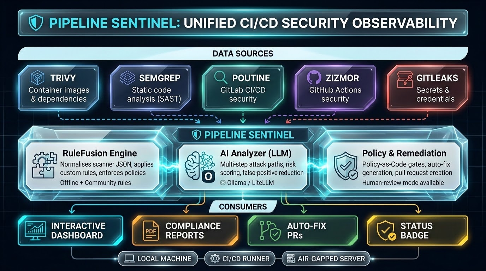
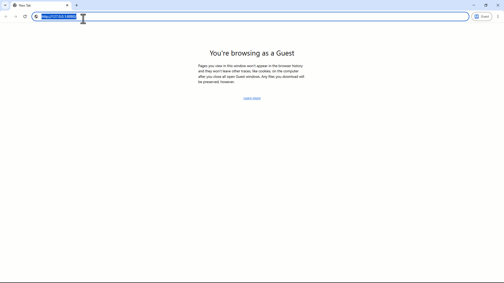

<div align="center">

# 🛡️ Pipeline Sentinel

**开源 DevSecOps 指挥中心 — 统一、分析、修复。**

[](https://pypi.org/project/devsecops-radar/)
[](LICENSE)
[](https://github.com/Mehrdoost/devsecops-radar/releases)
[](https://github.com/Mehrdoost/devsecops-radar/actions)
[](https://github.com/Mehrdoost/devsecops-radar/stargazers)

</div>

> 📖 **其他语言版本：** [English](README.md) | [Русский](README_ru.md)

---

## 📖 目录

1. [什么是 Pipeline Sentinel？（通俗解释）](#-什么是-pipeline-sentinel通俗解释)
2. [为什么你需要它](#-为什么你需要它)
3. [应该部署在网络中的什么位置](#-应该部署在网络中的什么位置)
4. [仪表盘预览](#-仪表盘预览)
5. [快速开始](#-快速开始)
6. [先决条件 (Prerequisites)](#-先决条件-prerequisites)
7. [安装](#-安装)
8. [使用指南（分步说明）](#-使用指南分步说明)
9. [完整命令参考](#-完整命令参考)
10. [核心功能](#-核心功能)
11. [社区规则与在线更新](#-社区规则与在线更新)
12. [架构](#️-架构)
13. [路线图](#️-路线图)
14. [测试与 CI](#-测试与-ci)
15. [参与贡献](#-参与贡献)
16. [作者](#-作者)
17. [许可证](#-许可证)

---

## 👨‍👩‍👧 什么是 Pipeline Sentinel？（通俗解释）

想象一下有几个保安，每个人都在看守大楼的不同大门。他们都用不同的语言大喊他们的发现，而你必须到处跑才能了解发生了什么。**Pipeline Sentinel** 将他们全部放在一个房间里，翻译他们的报告，并为你展示一个单一、清晰的全景屏幕。

它连接到各种工具，如 **Trivy**（检查容器）、**Semgrep**（扫描代码）、**Poutine**（审计 GitLab 流水线）、**Zizmor**（保护 GitHub Actions）和 **Gitleaks**（查找硬编码凭证）。你无需挖掘多个 JSON 文件，即可获得一个**漂亮的深色模式仪表盘**，它会告诉你什么是关键问题，风险趋势如何，甚至攻击者如何将几个小问题链接成一次大攻击。

可以将其视为**整个 CI/CD 流水线的安全监控系统** —— 它监视一切，向你发出警报，甚至提出修复建议，如果你愿意，所有这些都可以在没有互联网连接的情况下工作。

---

## 💥 为什么你需要它

在 2026 年，**供应链攻击**已成为头号威胁。像 Trivy 这样的工具本身也曾遭到破坏，攻击者现在直接将恶意代码注入构建流水线中。**你不能再仅仅扫描你的代码；你必须扫描你的流水线。**

Pipeline Sentinel 为你提供：
* **一个屏幕查看所有扫描器** – 停止在各种日志文件之间切换。
* **理解攻击链的 AI** – “泄露的密钥 + 旧库 = 灾难。”
* **自动修复** – 只需一个标志，它就会修补文件并打开拉取请求 (PR)。
* **人工审查模式** – 在应用每个修复程序之前进行检查。
* **合规性报告** – 为你的老板或审计员生成 PDF。
* **100% 离线支持** – 在安全至上的气隙/物理隔离环境中工作。
* **交互式向导** – 只需一个命令即可让一切运行起来。

---

## 📍 应该部署在网络中的什么位置

Pipeline Sentinel 的设计非常**灵活** — 由你决定它最适合哪里：

| 部署环境 | 描述 |
| :--- | :--- |
| 🖥️ **本地开发机** | 直接在你的笔记本电脑上运行 CLI 和仪表盘。非常适合希望获得即时反馈的独立渗透测试人员或开发人员。 |
| 🔧 **CI/CD Runner** | 在 Jenkins/GitLab CI 脚本中使用 GitHub Action 或直接调用 `devsecops-radar`。如果严重漏洞超出你的策略 (`--policy`)，它可以使构建失败。 |
| 🏢 **中央安全服务器** | 安装在专用服务器上（通过 Docker 或 pip），收集多个团队的扫描结果。成为共享的安全运营控制台。 |
| 🌐 **物理隔离网络 (Air-Gapped)** | 将 Docker 镜像和样本数据复制到离线服务器。仪表盘无需外部网络调用 — 所有资源均内置。 |

### 典型网络拓扑

```text
[Trivy 扫描] ──┐
[Semgrep 扫描] ─┤
[Poutine 扫描] ─┼──> devsecops-radar (CLI) ──> findings.json ──> 仪表盘 (Flask) ──> 浏览器
[Zizmor 扫描] ─┘
[Gitleaks 扫描] ┘
```

> **📌 图表占位符：** 


---

## 📸 仪表盘预览



*(严重性环形图、趋势折线图、攻击路径图（可点击节点）、拓扑视图、执行摘要 — 全部完全离线。)*

---

## 🚀 快速开始

```bash
# 1. 从 PyPI 安装
pip install devsecops-radar

# 2. 传入扫描器数据（仓库中包含样本数据）
devsecops-radar --trivy sample_trivy.json --semgrep sample_semgrep.json

# 3. 启动仪表盘
devsecops-radar-web
```

在浏览器打开 http://localhost:8080 — 你的统一仪表盘即可与样本结果一起上线。

🧙 **想要完全引导式设置？运行向导：**
```bash
devsecops-radar --wizard
```

---

## 📋 先决条件 (Prerequisites)

Pipeline Sentinel 依赖外部安全工具来生成它使用的 JSON 报告。你必须根据你的需求单独安装这些工具。

**离线扫描必需：**
* Trivy (安装)
* Semgrep (安装)
* Poutine (安装)
* Zizmor (安装)
* Gitleaks (安装)

**可选（用于 AI 分析）：**
* Ollama (安装)

> 📖 **有关更多详细信息，请参阅 `PREREQUISITES.md`。**

---

## 📦 安装

### 选项 1 — PyPI (推荐)
```bash
pip install devsecops-radar
```

### 选项 2 — 从源码安装
```bash
git clone [https://github.com/Mehrdoost/devsecops-radar.git](https://github.com/Mehrdoost/devsecops-radar.git)
cd devsecops-radar
pip install -e .
```

### 选项 3 — Docker
```bash
docker pull ghcr.io/mehrdoost/devsecops-radar:latest
docker run -p 8080:8080 ghcr.io/mehrdoost/devsecops-radar:latest
```

**挂载你自己的扫描结果文件：**
```bash
docker run -p 8080:8080 -v $(pwd)/findings.json:/data/findings.json ghcr.io/mehrdoost/devsecops-radar:latest
```

**或者使用 Docker Compose:**
```bash
docker compose up
```

### 🧙 一键安装 (curl)
```bash
curl -fsSL [https://raw.githubusercontent.com/Mehrdoost/devsecops-radar/main/install.sh](https://raw.githubusercontent.com/Mehrdoost/devsecops-radar/main/install.sh) | bash
```

*此脚本会安装 Python 依赖、Ollama，拉取 AI 模型，并启动向导。*

---

## 🧭 使用指南（分步说明）

### 1. 运行你的安全扫描器
从你的工具生成 JSON 输出：

```bash
trivy image --format json -o trivy.json nginx:latest
semgrep --config=auto --json --output semgrep.json .
poutine scan ./repo --format json --output poutine.json
zizmor scan ./repo --output zizmor.json --format json
gitleaks detect --source . --report-format json --report-path gitleaks.json
```

### 2. 使用 CLI 合并结果
```bash
devsecops-radar --trivy trivy.json --semgrep semgrep.json --poutine poutine.json --zizmor zizmor.json --gitleaks gitleaks.json
```

*这将生成一个包含所有已合并并标准化漏洞结果的单一 `findings.json` 文件。*

### 3. 查看仪表盘
```bash
devsecops-radar-web
```

仪表盘显示：
* **严重性细分** – 环形图
* **随时间变化的趋势** – 基于扫描历史的折线图
* **流水线安全** – Poutine + Zizmor 统计卡片
* **攻击路径图** – 交互式 D3.js 图
* **执行摘要** – 风险评分和 AI 生成的摘要
* **漏洞表格** – 可搜索、可过滤、分页显示

### 4. 启用 AI 分析（可选）
```bash
ollama pull llama3.2:latest
devsecops-radar --trivy trivy.json --analyze
devsecops-radar-web
```

LLM 生成包含以下内容的 `findings_ai_summary.json`：
* `executive_summary`, `risk_score`
* 包含 MITRE ATT&CK 战术的 `attack_paths`
* `top_remediations`（部分带有 `fix_diff`）
* `false_positives_likely`

### 5. 自动修复（带人工审查）
```bash
# 自动应用修复程序
devsecops-radar --trivy trivy.json --analyze --fix

# 在应用前逐一审查每个修复程序
devsecops-radar --trivy trivy.json --analyze --fix --review
```

*该工具会创建一个新的 git 分支 `auto-fix`，并推送它以供审查。*

### 6. 策略执行 (Policy Enforcement)
创建一个 `policy.json` 文件：
```json
{"max_critical": 5, "on_violation": "fail"}
```

```bash
devsecops-radar --trivy trivy.json --policy policy.json
```

*如果严重漏洞超过 5 个，命令将以状态码 1 退出 — 非常适合作为 CI/CD 门禁。*

### 7. 生成合规性报告
```bash
devsecops-radar --trivy trivy.json --analyze --compliance CIS --report cis-report.pdf
```

将创建一份包含执行摘要、风险评分、结果表格和合规性映射的 PDF 报告。敏感数据将自动被脱敏。

### 8. 为项目添加安全徽章
运行扫描后，你可以在 `README` 中嵌入一个动态安全徽章：

```markdown
[](https://github.com/Mehrdoost/devsecops-radar)
```

徽章颜色将根据严重漏洞的数量而变化（绿色/黄色/红色）。

---

## 📋 完整命令参考

### `devsecops-radar` — CLI 标志

| 标志 | 描述 | 示例 |
| :--- | :--- | :--- |
| `--trivy` | Trivy JSON 文件或镜像名称 | `--trivy results.json` 或 `--trivy nginx:latest` |
| `--semgrep` | Semgrep JSON 文件或目录 | `--semgrep results.json` 或 `--semgrep ./src` |
| `--poutine` | Poutine JSON 文件或仓库路径 | `--poutine results.json` 或 `--poutine ./repo` |
| `--zizmor` | Zizmor JSON 文件或仓库路径 | `--zizmor results.json` 或 `--zizmor ./repo` |
| `--gitleaks` | Gitleaks JSON 文件或仓库路径 | `--gitleaks results.json` 或 `--gitleaks ./repo` |
| `--rules` | 包含自定义 JSON 规则文件的目录 | `--rules ~/my-security-rules/` |
| `--policy` | 用于 CI 门禁的策略 JSON 文件 | `--policy policy.json` |
| `--analyze` | 启用 LLM 分析（需要 Ollama） | `--analyze` |
| `--llm-backend` | `ollama`（默认）或 `litellm` | `--llm-backend litellm` |
| `--llm-model` | 模型名称 | `--llm-model gpt-4o-mini` |
| `--fix` | 自动应用 AI 建议的修复 | `--fix` |
| `--review` | 在应用之前审查每个 AI 修复 | `--review` |
| `--topology` | 拓扑 JSON 文件的路径 | `--topology topology.json` |
| `--compliance` | 框架：`CIS`, `PCI-DSS`, `ISO27001` | `--compliance CIS` |
| `--report` | 生成 PDF 报告（输出文件名） | `--report security_report.pdf` |
| `--output` | 输出 JSON 文件 | `--output merged.json` |
| `--wizard` | 交互式首次设置向导 | `--wizard` |

### `devsecops-radar-web` — Web 服务器

```bash
devsecops-radar-web                          # 在 http://localhost:8080 上启动
FINDINGS_FILE=my.json devsecops-radar-web    # 使用自定义文件
PIPELINE_API_KEY=secret devsecops-radar-web  # 启用 API 身份验证（支持 JWT）
```

---

## ✨ 核心功能

### 🔌 多扫描器插件架构
内置支持五种扫描器，拥有真正的插件系统。第三方扫描器可以作为单独的包安装，并通过 Python entry points 自动发现。适配器模式通过 Pydantic 验证所有结果数据。

| 扫描器 | 扫描内容 | 标志 |
| :--- | :--- | :--- |
| **Trivy** | 容器镜像和依赖项 | `--trivy` |
| **Semgrep** | 静态代码分析 (SAST) | `--semgrep` |
| **Poutine** | GitLab CI/CD 配置安全 | `--poutine` |
| **Zizmor** | GitHub Actions 工作流安全 | `--zizmor` |
| **Gitleaks**| 密钥硬编码检测 | `--gitleaks` |

### 🧩 混合 RuleFusion 引擎
* **离线** – 从任何本地目录加载自定义 JSON 规则 (`--rules ~/my-rules/`)
* **在线** – 从可配置的 Git 仓库提取社区策划的规则 (`--update-rules`)
* 社区规则仓库：`devsecops-radar-rules`

### 🧠 LLM 驱动的分析
* 为不稳定的端点提供带指数退避的重试逻辑
* 感知 Token 的结果选择
* 支持 Ollama（本地、离线）和 LiteLLM（OpenAI、Anthropic 等）

### 🕸️ 多步攻击路径可视化
交互式 D3.js 物理图，接受拓扑文件，将结果映射到你的实际基础设施上。

### 🛡️ 策略即代码 (Policy‑as‑Code)
非常适合用于阻断 CI/CD 流水线。

### 🛠️ 带有人工循环的自动修复
该工具会创建一个新的 git 分支并生成 `fix.sh` 脚本。

### 📊 合规性与执行报告（带脱敏功能）
生成 PDF 报告，自动脱敏密码、Token、JWT。

### 📈 扫描历史记录和趋势（带分页）
支持服务器端分页的 SQLAlchemy 后端数据库 (`/api/findings?page=1&per_page=50`)。

### 🧪 SBOM & 依赖混淆检测
* 使用 `syft` 从你的项目生成 CycloneDX SBOM
* 检测 `package.json` 和 `requirements.txt` 中的依赖混淆风险

### 🔍 RAG 驱动的安全搜索
内置的 RAG 端点 (`/api/rag?q=...`) 用于自然语言搜索。

### ⚔️ 攻击模拟（沙盒）
在一次性 Docker 容器中执行简单的 PoC 脚本。

### 📉 动态风险评分
基于资产暴露情况和漏洞利用可用性进行评分。

### 🔒 隐私与离线优先
* 所有资源均已嵌入 — 无需 CDN 调用
* LLM 分析通过 Ollama 在本地运行
* Docker 镜像以非 root 身份运行

---

## 🌍 社区规则与在线更新

Pipeline Sentinel 具有一个社区驱动的规则市场，位于一个独立的仓库中：`devsecops-radar-rules`。

### 它是如何工作的
该仓库包含精选的 JSON 规则文件。用户只需一个命令即可拉取最新规则：

```bash
devsecops-radar --update-rules
```

规则存储在本地的 `~/.devsecops-radar/community-rules/` 中。要将它们与扫描结果一起使用：

```bash
devsecops-radar --trivy scan.json --rules ~/.devsecops-radar/community-rules/
```

你可以通过设置 `COMMUNITY_RULES_REPO` 环境变量指向自己的仓库。

### 贡献规则
1. Fork `devsecops-radar-rules` 仓库。
2. 在 `rules/` 目录中添加一个新的 JSON 文件。
3. 打开一个 Pull Request。

---

## 🏗️ 架构

```text
devsecops_radar/
├── cli/            # CLI 入口点 – 插件发现、策略、修复
├── core/           # RuleFusion 引擎、数据库 (SQLAlchemy)、LLM 分析器
├── scanners/       # 可插拔扫描器类（扩展 ScannerPlugin）
├── plugins/        # ScannerPlugin 抽象基类和 entry points
└── web/            # Flask 仪表盘（模块化 Blueprints）
    ├── dashboard/  # 主仪表盘路由和嵌入式 HTML
    ├── attack_paths/
    ├── topology/
    ├── summary/
    └── sentry/     # CI/CD 实时 Webhook 代理
```

> **📌 图表占位符：** 


---

## 🗺️ 路线图

| 阶段 | 功能 | 状态 |
| :--- | :--- | :--- |
| ✅ Phase 1 | 多扫描器引擎 (Trivy, Semgrep, Poutine, Zizmor) | 已完成 |
| ✅ Phase 1 | LLM 分析 (Ollama + LiteLLM) | 已完成 |
| ✅ Phase 1 | 扫描历史记录，趋势图 | 已完成 |
| ✅ Phase 1 | GitHub Action (composite) | 已完成 |
| ✅ Phase 1 | Docker 镜像 (multi‑stage, non‑root) | 已完成 |
| ✅ Phase 2 | 结合 MITRE ATT&CK 和拓扑的攻击路径可视化 | 已完成 |
| ✅ Phase 2 | 策略即代码引擎 (`--policy`) | 已完成 |
| ✅ Phase 2 | 自动修复引擎 (`--fix`) | 已完成 |
| ✅ Phase 2 | 带自动脱敏的合规报告 (PDF) | 已完成 |
| ✅ Phase 2 | 混合 RuleFusion 引擎（本地 + 社区规则） | 已完成 |
| ✅ Phase 3 | Web 仪表盘 Blueprint 重构（模块化 Flask） | 已完成 |
| ✅ Phase 3 | 真正基于 entry points 的扫描器插件系统 | 已完成 |
| ✅ Phase 3 | 带分页功能的 SQLAlchemy ORM | 已完成 |
| ✅ Phase 3 | SBOM & 依赖混淆检测 | 已完成 |
| ✅ Phase 3 | 基于 RAG 的安全搜索 | 已完成 |
| ✅ Phase 3 | 攻击模拟（沙盒） | 已完成 |
| ✅ Phase 3 | 动态风险评分 | 已完成 |
| ✅ Phase 3 | 交互式向导 (`--wizard`) | 已完成 |
| ✅ Phase 3 | 人工审查模式 (`--review`) | 已完成 |
| ✅ Phase 3 | Gitleaks 密钥扫描器 | 已完成 |
| ✅ Phase 3 | 安全状态徽章端点 | 已完成 |
| ✅ Phase 3 | 完整的测试套件和 CI 流水线 | 已完成 |
| 🔲 Phase 4 | Jira / Slack 集成 | 计划中 |
| 🔲 Phase 4 | SARIF & CycloneDX 支持 | 计划中 |
| 🔲 Phase 4 | Pull Request 助手 (GitHub App) | 计划中 |

---

## 🧪 测试与 CI

Pipeline Sentinel 经过了全面的测试，以确保在生产环境中的可靠性。
* **单元和集成测试：** 23 个测试，涵盖扫描器、规则引擎、数据库、分析器、API 和 CLI。
* **CI 流水线：** 每个 push 和 pull request 都会通过 GitHub Actions 触发自动化测试 (pytest) 和代码检查 (ruff)。

你可以在本地运行测试：
```bash
pip install -e .
pip install pytest pytest-flask ruff
pytest tests/ -v
ruff check .
```

---

## 🤝 参与贡献

热烈欢迎提交 Pull requests 和 issues！请阅读我们的 `CONTRIBUTING.md`，获取有关如何设置项目、添加新扫描器或提交规则更改的详细指南。

---

## 👨‍💻 作者

**ReverseForge** — ( Mehrdoost And Mi0r4 ) 

[](https://github.com/ReverseForge) 
[](https://github.com/Mehrdoost) 
[](https://github.com/miora-sora) 

---

## 📜 许可证

MIT — 详见 [LICENSE](LICENSE) 文件。

<div align="center">
⭐ 如果这个项目帮助你的团队发布了更安全的软件，请点亮一颗星 —— 这会带来很大的不同。
</div>